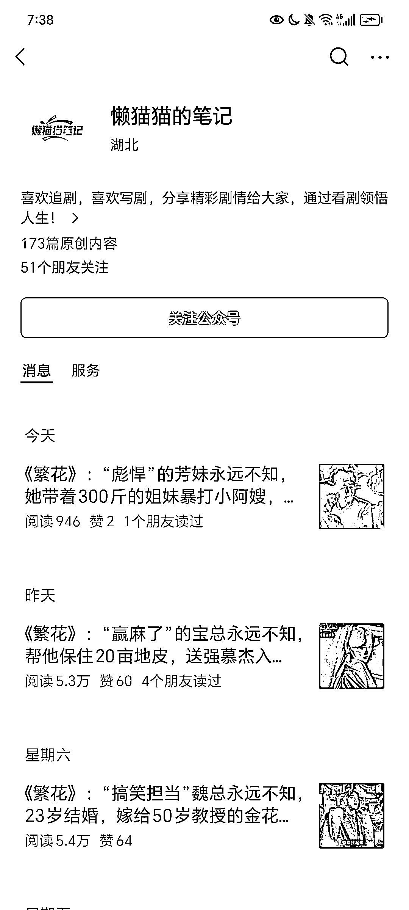
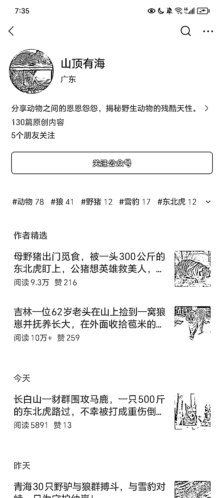
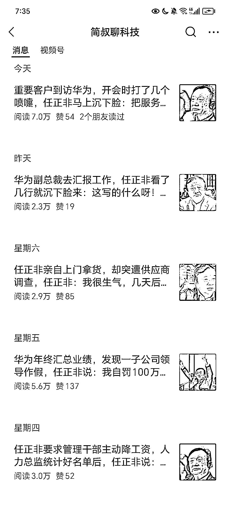

# 公众号流量主的最新玩法：选择小众领域，避开同质化

> 原文：[`www.yuque.com/for_lazy/xkrm14/gyyx6zeppqh7vugu`](https://www.yuque.com/for_lazy/xkrm14/gyyx6zeppqh7vugu)

作者： 一来

日期：2024-02-19

点赞数：**71**

* * *

正文：

公众号流量主的最新玩法---关于领域的选择。 很多人做流量主遇到最头疼的问题，就是容易死号，突然间没有流量了。
但如果能够锁定一些小众领域，往往能够避开同质化，也能够拿到一个很好的结果。
1.剧评赛道。目前来说，还是很稳定的，一个月做出来后也能有 5000-10000 元。 比如对标：懒猫猫的笔记 2.动物故事赛道。比如对标：山顶有海
3.华为领域：简叔聊科技

* * *

评论区：

晴天哥哥 : 是的，我前几个月转行高考赛道，收入也挺可观，还不挤。

* * *

公众号懒人搜索，懒人专属群分享