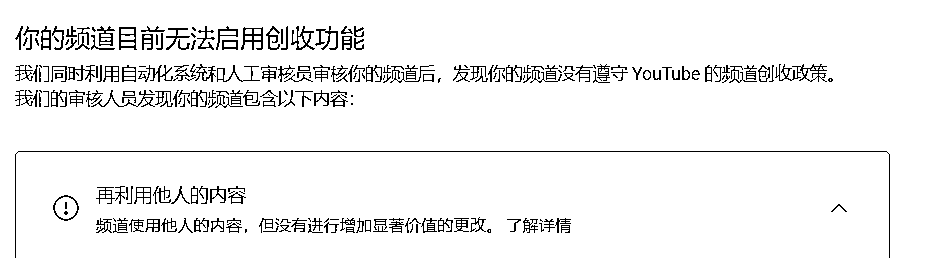
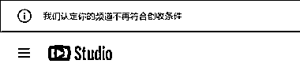

# YouTube 解说类账号收到获利停止通知，申诉成功恢复

> 原文：[`www.yuque.com/for_lazy/xkrm14/kw7iy2kaz820gggl`](https://www.yuque.com/for_lazy/xkrm14/kw7iy2kaz820gggl)

作者： 毛豆

日期：2024-02-21

点赞数：**40**

* * *

正文：

最近 youtube 不知道抽什么风，有很多的解说类的账号（电影解说，案件解说，人物解说，各种解说），都收到了获利停止的通知，理由是：再利用他人内容，哪怕是百万粉丝的大号也收到了，我们有两个频道也碰到了。碰到这种情况不要慌，感觉 youtube 就是广撒网策略，大胆的申诉就好，按照页面上显示的申诉要求，把自己的创作过程说明白，把剪辑截图，工作场景，素材截图，文案截图这些都放上去，一般两天内就能恢复。我们两个频道都已恢复！就是糟心了点，申诉的工作量还挺多。真是服了这个老六😂

* * *

评论区：

allen : 上次更新之后还有什么方法可以看别人的频道是否获利？之前看代码的那个方法不管用了

毛豆 : 没有了😂，一般达到获利条件后，还一直在更新的，很有可能就是获利了

* * *

公众号懒人搜索，懒人专属群分享