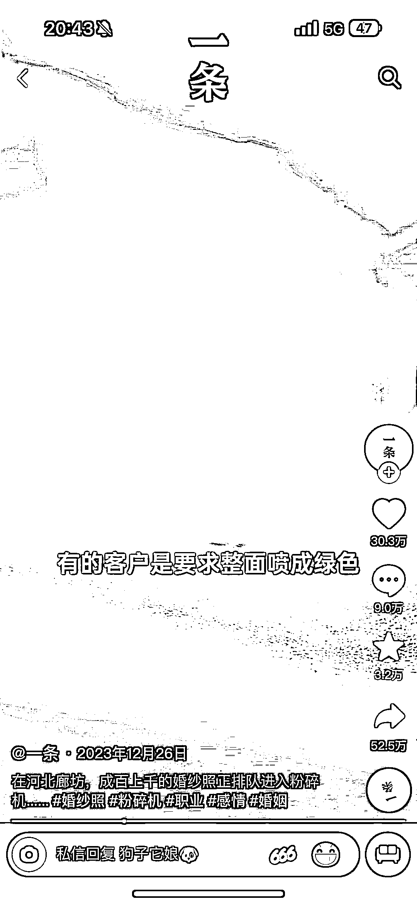
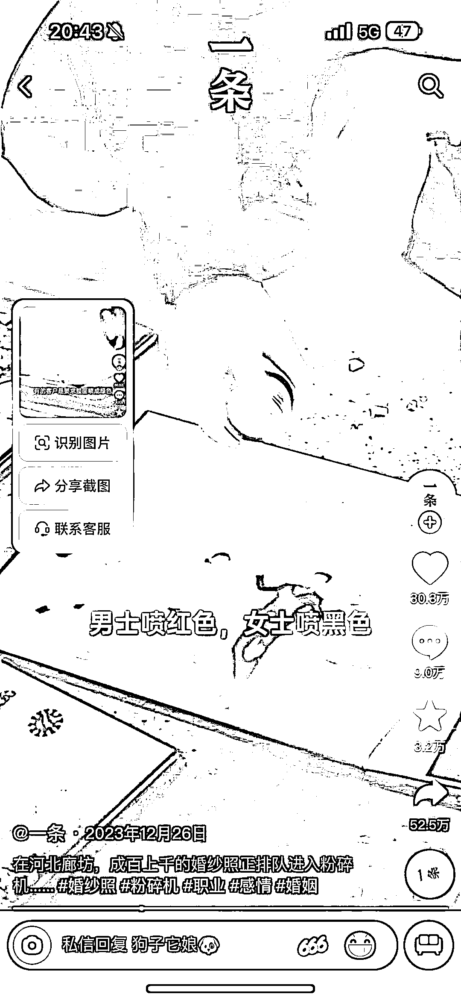
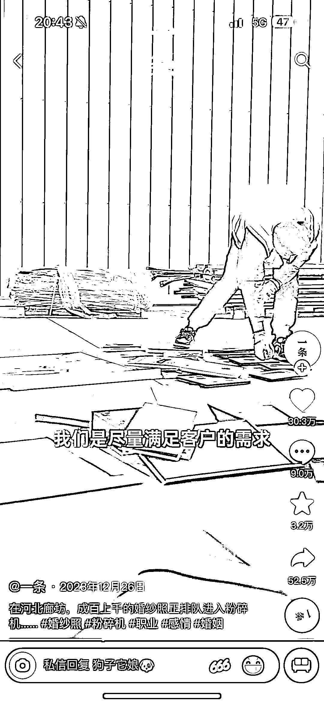

# 刘老斯：销毁结婚照的新兴生意火爆进行中

> 原文：[`www.yuque.com/for_lazy/xkrm14/deuh2i3iubbruoc5`](https://www.yuque.com/for_lazy/xkrm14/deuh2i3iubbruoc5)

作者： Doris 叨叨

日期：2024-02-18

点赞数：**52**

* * *

正文：

销毁结婚照 抖音上有一个名叫 刘老斯
的博主，在 2023 年小小地带火了一门生意：替结束了婚姻的人们销毁失效的结婚照。他的服务品牌还特别有 80 年代港片的范儿，叫“爱海捐躯客”，意思是，粉碎结婚照就当上一段人生为爱捐躯了，
刘老斯
真名叫刘玮，生意开在河北廊坊。他早前做的是帮个人客户销毁隐私物品的生意，档案、硬盘、手机等等，生意不大。2023 年 3 月份，有个离婚的朋友找他，托他销毁结婚照，他就突发奇想把这事儿拓展成了正式业务。
一跑下来发现还真的可行，这门生意做了 10 个月，刘老斯 已经接了 700 单销毁结婚照的生意。进入 2024 年，他一个月的订单量就已经有接近 300
单了。他的客户大多在 20 多岁到 40 多岁，女性占比超过 70%。

* * *

评论区：

* * *

公众号懒人搜索，懒人专属群分享