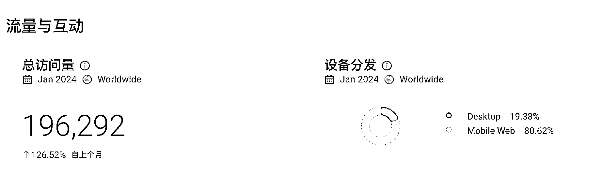

# 小词也能赚大钱，流量不是唯一关键

> 原文：[`www.yuque.com/for_lazy/xkrm14/ub6b57ptr7rga2gl`](https://www.yuque.com/for_lazy/xkrm14/ub6b57ptr7rga2gl)

作者： 哥飞

日期：2024-02-18

点赞数：**41**

* * *

正文：

截图中这个网站，1 月份在 Similarweb 上显示的访问量还不到 20 万，但是广告加用户付费收入已经超过 3000 美元了。
部分朋友可能会有流量错觉，认为要很大的流量才能赚钱，所以一直去找那些低优化难度的大流量关键词，但这种词其实很少，比较难找到。
所以其实我们更应该从小词做起，对于直接搜索关键词过来的精准流量，每个月有 10 几万访问量，就可以有 1000 多美元收入了。
你做一个月收入 1 万美元的网站很难，但是做 10 个月收入 1000 美元的网站就容易多了。 所以多上站才是最优策略。

* * *

评论区：

财火 : [强][强]

* * *

公众号懒人搜索，懒人专属群分享