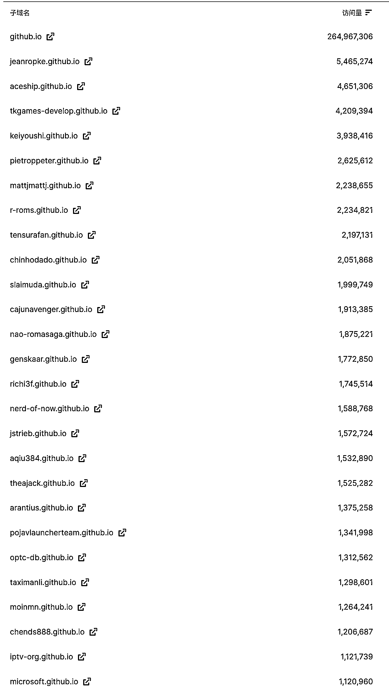

# 零成本建站方案：无需购买域名和服务器

> 原文：[`www.yuque.com/for_lazy/xkrm14/sa6sndzix5gq7kyg`](https://www.yuque.com/for_lazy/xkrm14/sa6sndzix5gq7kyg)

作者： 哥飞

日期：2024-02-19

点赞数：**62**

* * *

正文：

跟大家介绍下出海做网站的零成本方案。 域名和服务器其实都非必须的，用 或者 或者 这些平台，可以不需要购买服务器，也不需要购买域名，就可以零成本建站。
这些平台都会提供子域名给我们使用，在一定的访问量之内，也是完全免费的。 截图是部分 Github Pages 做的大流量网站，月访问量过百万的一屏都放不下。
当然，如果你愿意花一年几十块钱买一个自己的域名，配置上去，网站看起来会更正式。[Vercel: Build and deploy the best Web
experiences ...](https://Vercel.com) [`Pages.Github.com`](https://Pages.Github.com) [Cloudflare Pages documentation · Cloudflare
Pages...](https://developers.Cloudflare.com/pages/)

* * *

评论区：

谢同学 : 这个好

* * *

公众号懒人搜索，懒人专属群分享