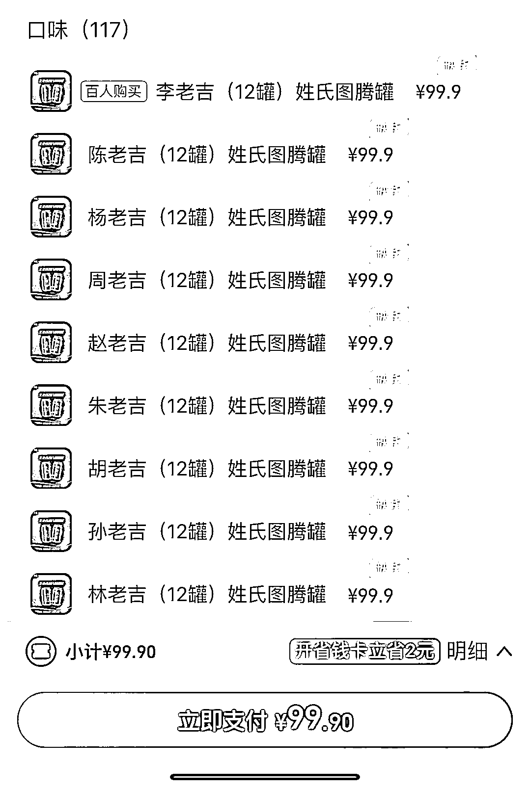
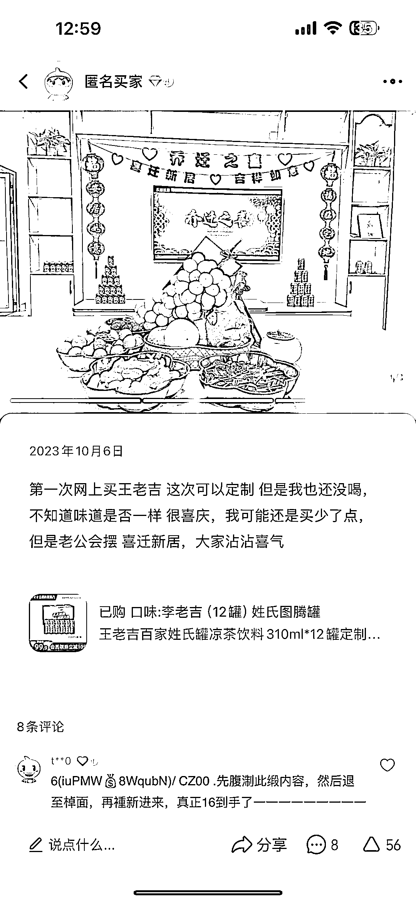

# 王老吉姓氏图腾包装引爆市场，定制产品受欢迎

> 原文：[`www.yuque.com/for_lazy/xkrm14/vzqlylfuxtviye9b`](https://www.yuque.com/for_lazy/xkrm14/vzqlylfuxtviye9b)

作者： 斑马森林

日期：2024-02-22

点赞数：**45**

* * *

正文：

很不错的营销案例，姓氏图腾 中华古姓来源于图腾崇拜，系氏族徽号或标志，标示一个人的家族血缘关系的标志和符号
王老吉推出的这个姓氏图腾包装，还可以定制，逢年过节，节日庆典，乔迁聚会，深受用户喜爱，一度抢空
在淘宝搜索了姓氏，相关的拓展词也特别多，有些产品受众也很多，比如姓氏定制酒，姓氏钥匙扣等 拓展一下，很多产品也可以借鉴这个思维

* * *

评论区：

* * *

公众号懒人搜索，懒人专属群分享