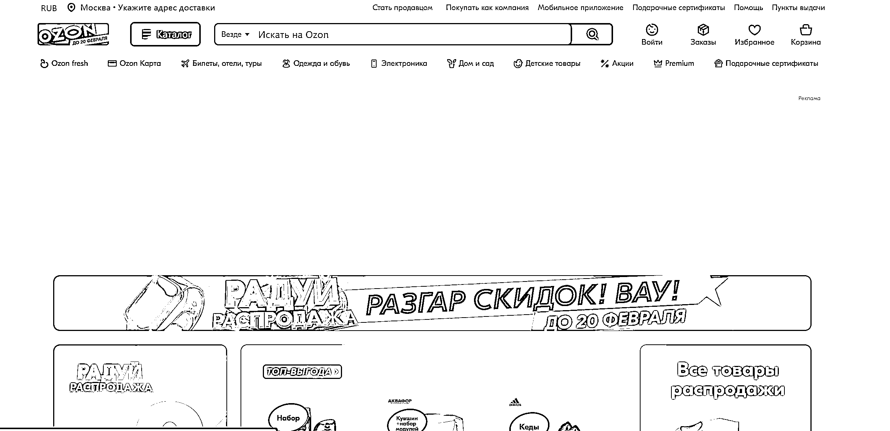

# 俄罗斯电商 Ozon 2023 年 GMV 同比增长约 110%

> 原文：[`www.yuque.com/for_lazy/xkrm14/pygxwvrlgw6loug7`](https://www.yuque.com/for_lazy/xkrm14/pygxwvrlgw6loug7)

作者： 李瑞腾

日期：2024-02-20

点赞数：**27**

* * *

正文：

俄罗斯电商 Ozon 2023 年 GMV 同比增长约 110% Ozon 近日公布了其截至 2023 年 12 月 31 日全年未经审计的初步经营业绩。
2023 年全年，该公司包括服务在内的 GMV 同比增长约 110%，领先于为 2023 年全年设定的与 2022 年全年相比增长 90%至 100%的目标。
由于订单数量的显著增加和平均订单价值的提高，包括服务在内的 GMV 超过 1.7 万亿卢布。 截至 2023 年 12 月 31 日，Ozon
平台的活跃用户数达到 4600 万，每位活跃买家每年的订单超过 20 个。

* * *

评论区：

* * *

公众号懒人搜索，懒人专属群分享