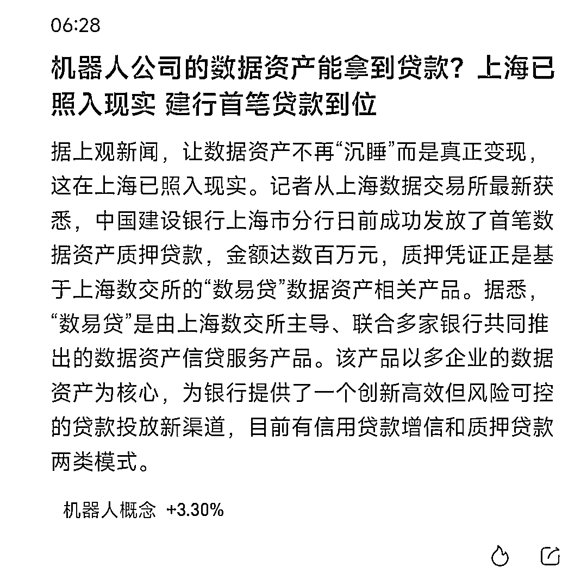

# 中国建设银行上海分行成功发放首笔数据资产质押贷款

> 原文：[`www.yuque.com/for_lazy/xkrm14/hkheob1icbb8q7xg`](https://www.yuque.com/for_lazy/xkrm14/hkheob1icbb8q7xg)

作者： 酱图森

日期：2024-02-23

点赞数：**37**

* * *

正文：

据上观新闻，让数据资产不再“沉睡”而是真正变现，这在上海已照入现实。
记者从上海数据交易所最新获悉，中国建设银行上海市分行日前成功发放了首笔数据资产质押贷款，金额达数百万元，质押凭证正是基于上海数交所的“数易贷”数据资产相关产品。
从事数据、机器人方面的圈友可以关注一下。

* * *

评论区：

温暖的冰块 : 未来数据将合规化交易

酱图森 : 谢谢，亦仁老板

酱图森 : 有奔头

* * *

公众号懒人搜索，懒人专属群分享