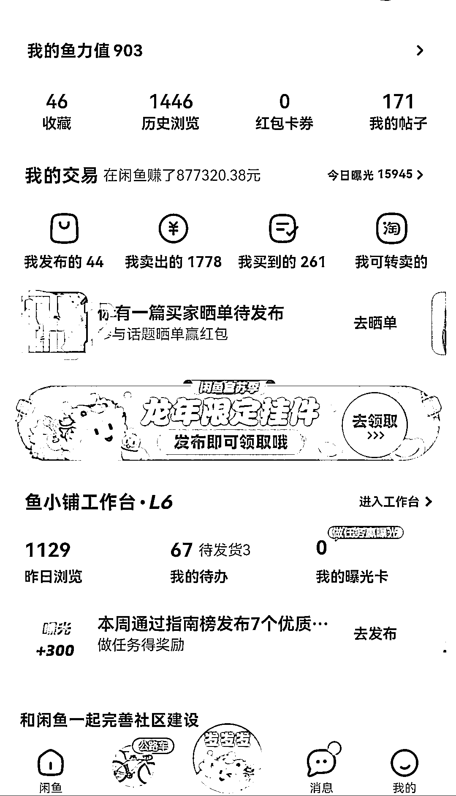

# 闲鱼二手电子产品账号去年营业额超 80 万，出单简单易做

> 原文：[`www.yuque.com/for_lazy/xkrm14/zqhedhro9lybkc93`](https://www.yuque.com/for_lazy/xkrm14/zqhedhro9lybkc93)

作者： 老李

日期：2024-02-19

点赞数：**76**

* * *

正文：

闲鱼虽然说是最简单的电商，出单还是比较简单的，去年最好的一个账号营业额 80 多万，主做二手电子产品，没项目的可以考虑一下

* * *

评论区：

能量菌 : 货源从哪里来呢

郭二毛 : 货源从哪里来呢

自律更自由 : 货源从哪里来呢

鱼儿游四方 : 我也挺关心这个问题

小沐 : 货源是难点，如果自己收货源，很难分辨产品的质量。

老李 : 有很多圈友想问货源问题，我统一回复下，货源有拍拍清仓，采货侠，拍机堂，还有闲鱼购买再转卖，可以用一个闲鱼号专门做一个买货的号，有专门的闲鱼监控软件，设置好商品价格有低价发布的直接能监控到，然后直接拍下，但是不直接付款，自己看了合适就可以付款。
还有在闲鱼购买然后在抖音卖的，多种方式，找到适合自己的就好，哈哈哈~

胡祥军 : 方便链接下吗，求闲鱼监控软件

* * *

公众号懒人搜索，懒人专属群分享