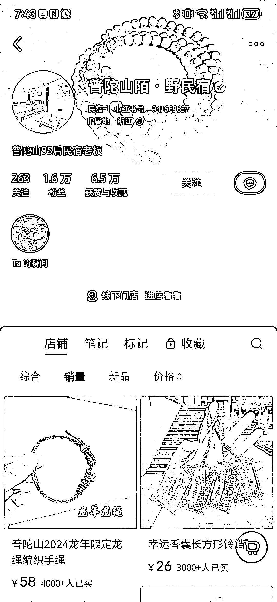
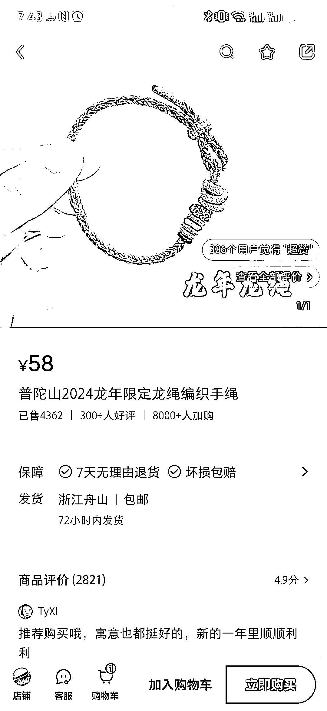
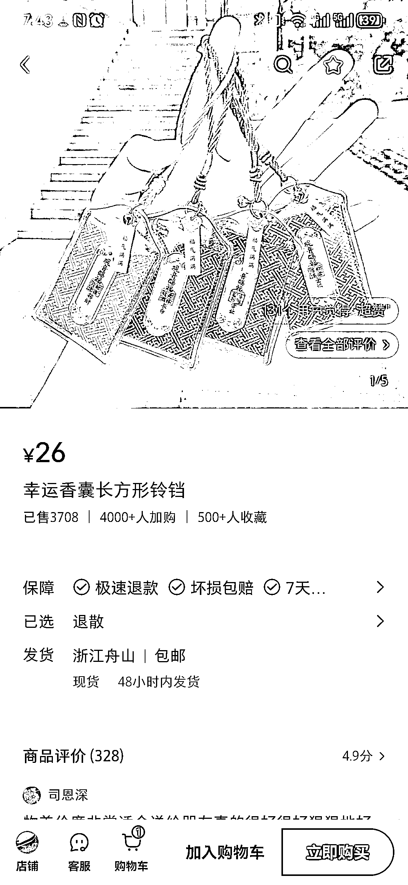
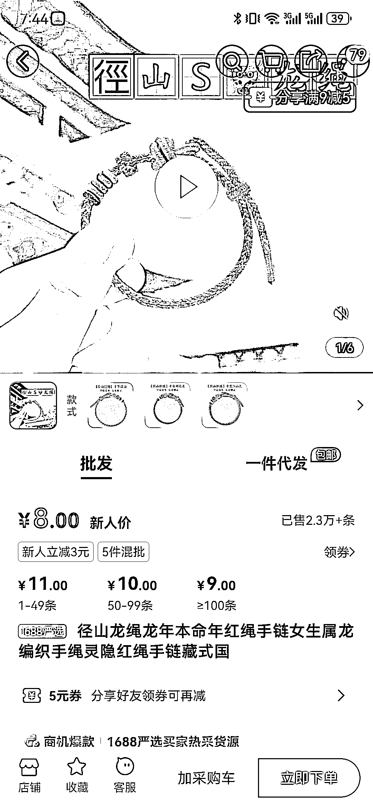
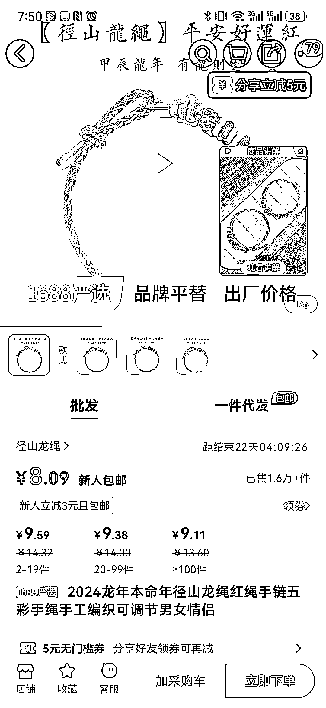
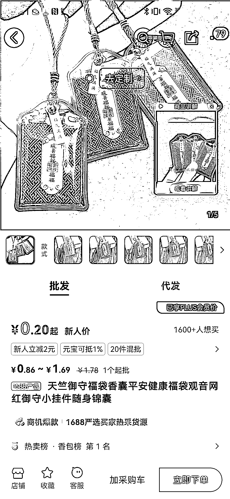

# 小红书上龙年龙绳销量飙升，利润高达 20 多万

> 原文：[`www.yuque.com/for_lazy/xkrm14/lus069f8b4hov0oh`](https://www.yuque.com/for_lazy/xkrm14/lus069f8b4hov0oh)

作者： 玉玉

日期：2024-03-08

点赞数：**156**

* * *

正文：

小红书上一个普陀山民宿的老板发的龙年龙绳销量都很高，而且不止一款，龙绳因为都是有好寓意的还不会退款，利润也非常高，阿里才 11 块钱，小红书卖到了 58💰一个，光龙绳一个品就有 4362*（58-11）=20 多万的利润，还有 8000 人加购物车！
另一个品更夸张阿里 1 块多，小红书卖 26💰已经快卖 4000 个了！ 其他几个款都有几百的销量，目测这个老板还可以宣传自己的民宿

* * *

评论区：

パイナップル : 他有普陀山的加持

玉玉 : 是的，主要就是普陀山

パイナップル : 在别的地方卖的话，换成各地区出名寺庙也会买的好的吧

奈良美京 : 在北京是不是可以雍和宫手串

玉玉 : 可以运用到自己本地有名的寺庙，主要拍的背景要真实

玉玉 : 还有一个叫杭州小跑腿的数据也很好，可以对标试试

奈良美京 : 是这样子

* * *

公众号懒人搜索，懒人专属群分享