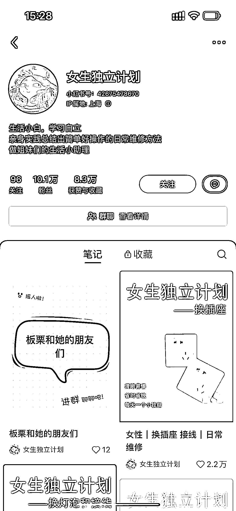
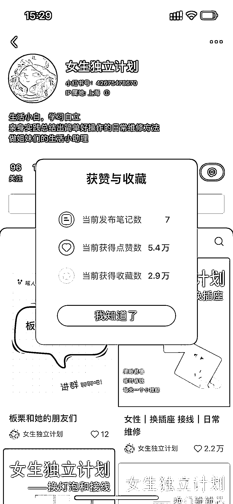
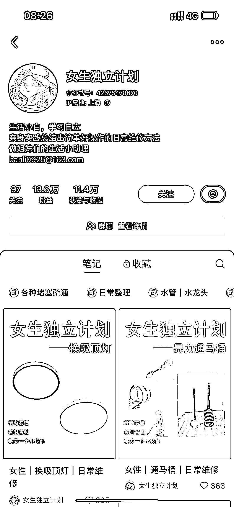
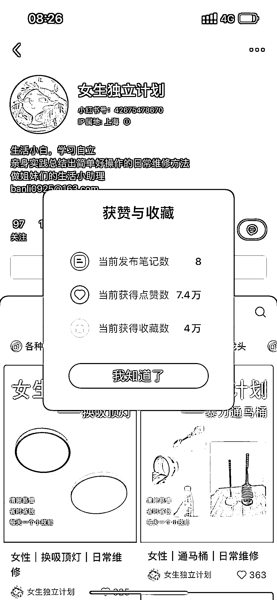

# 小红书女性成长赛道：发布日常生活小技巧，涨粉速度飞快

> 原文：[`www.yuque.com/for_lazy/xkrm14/truax7e5uzkck3id`](https://www.yuque.com/for_lazy/xkrm14/truax7e5uzkck3id)

作者： Lucie

日期：2024-03-04

点赞数：**100**

* * *

正文：

小红书的女性成长赛道还很有潜力，发布一些日常生活小技巧，定位独立女性，发布 8 篇帖子已经 14w 粉丝，一天前是 10w，涨粉速度飞快，思路值得学习

* * *

评论区：

怪力小乔巴 : 变现路径是什么呢

逍遥公子 : 这个号太可怕了，已经 17w+粉了，是我见过最快的涨粉机器。明星有的都没这么强。

逍遥公子 : 她的定位家居博主，后期带货，接广，卖课都可以。

Lucie : 我第一次看到的时候好像才 1w 多粉，隔两天就 10w 了。。

苏打 : 这个号好牛 证明内容有很多人买单 独居女性群体庞大 同类型应该可复制

倪大胖 : 独居女性群体，mark

雨阳 : 现在是 21.7 万了 强

* * *

公众号懒人搜索，懒人专属群分享