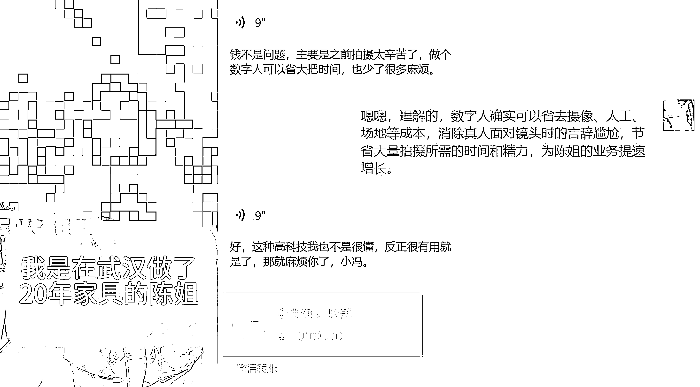

# 数字人私人定制：商机巨大，节省时间成关键

> 原文：[`www.yuque.com/for_lazy/xkrm14/tseqlv9z1gr6k4kp`](https://www.yuque.com/for_lazy/xkrm14/tseqlv9z1gr6k4kp)

作者： PONY

日期：2024-03-08

点赞数：**146**

* * *

正文：

今天无意中发现了一个数字人变现的新场景：为商家提供私人定制。起因是下午身边一个熟人陈姐看到我朋友圈一直在分享数字人相关的内容，问我能否帮她定制一个数字人。陈姐是做家具生意的，需要在抖音发短视频营销，每次拍视频需要请摄影、人工，还得化妆，费时费力。我给她做了一个定制的数字人样品，尝试报了个 1W 的客单价，帮她定制十个数字人模型。没想到她很爽快就支付了，这说明数字人在 TO
B 私人定制这块会有很大的发展前景。毕竟这些商人不是很懂 AI 技术，但他们对节省时间、提高效率上面的支出是非常舍得的。

* * *

评论区：

小孙 : 昨天试着做了一个自己的。试了试流量。还行。还有需要优化的地方。虽然情感不够到位，但是确实提效很多。

东兴 : 大佬，怎么定制，有相关教程可以看看吗[抱拳][抱拳][抱拳]

秋闯 : 如何定制

老船长李阳 : 数字人作品会被标记虚拟数字人作品吧

* * *

公众号懒人搜索，懒人专属群分享