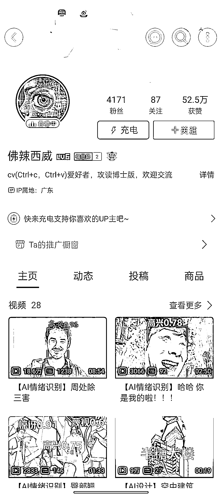
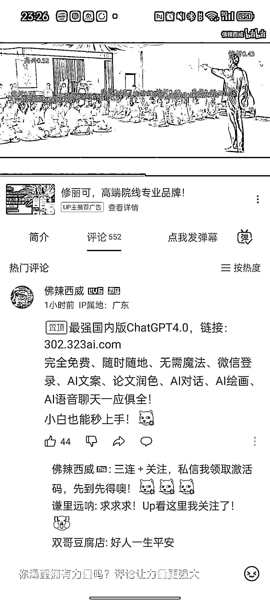
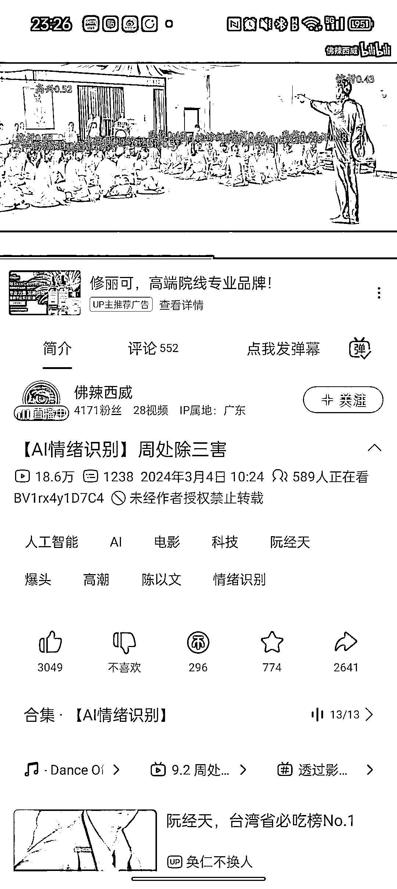
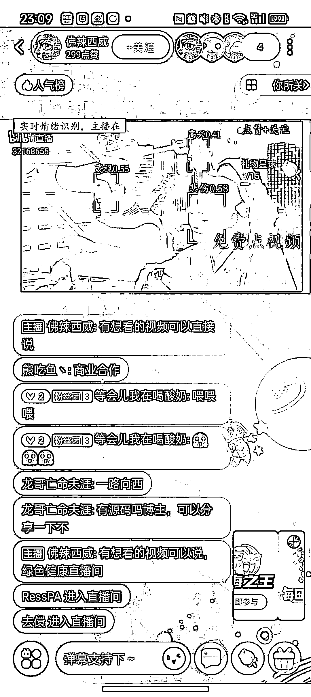

# AI 情绪识别账号在 B 站走红，视频观看量已达数百万

> 原文：[`www.yuque.com/for_lazy/xkrm14/sibttbdioixg589i`](https://www.yuque.com/for_lazy/xkrm14/sibttbdioixg589i)

作者： 退堂鼓艺术家

日期：2024-03-04

点赞数：**53**

* * *

正文：

【AI 情绪识别】​ B 站发现的账号，今年年初开始发布相关视频。已经有数个百万视频。
主要是运用 yolo+opencv 识别，对人物面部进行追踪，实时识别情绪数值。
视频的话选取一些热门抽象视频(摇摆拳王)，影视片剧节选(周处除三害)，或是一些时下热梗(春山学)，对人物表情进行分析，流量看起来不错，而且可有持续输出性。
目前这个账号通过实时直播影视剧集，开启 AI 识别，观众可以通过送礼进行影片点播，或者是对一些 AI 相关站点进行引流。还开了橱窗推广带货。
在抖+小红书搜索了下类似的视频不多，可尝试复制。

* * *

评论区：

* * *

公众号懒人搜索，懒人专属群分享