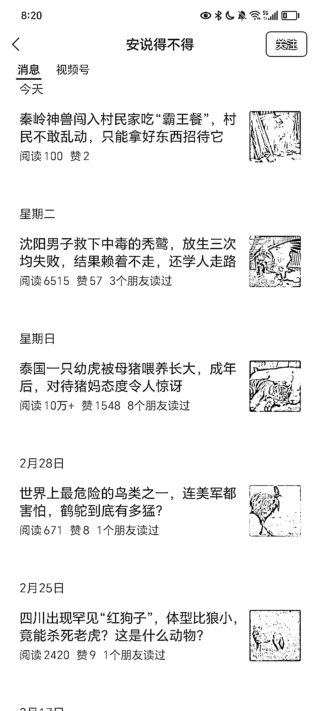
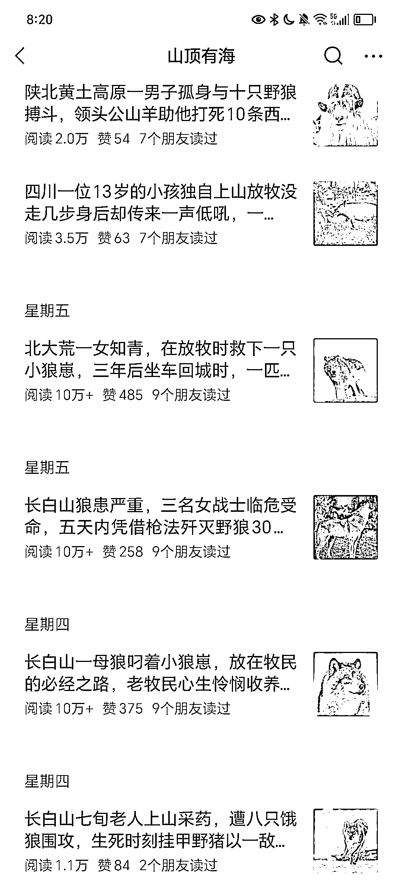

# 公众号流量主：细分领域账号赚钱效益高

> 原文：[`www.yuque.com/for_lazy/xkrm14/sfl87ltyn13gku6z`](https://www.yuque.com/for_lazy/xkrm14/sfl87ltyn13gku6z)

作者： 一来

日期：2024-03-07

点赞数：**102**

* * *

正文：

公众号流量主，现在很多细分领域的账号，能够活得很好，而且单价还真不低。 目前测试的教育类账号，一天一篇文章，收益也能快四位数一天。
如果对于个人玩家来说，就可以做 1-2 个账号，细分领域，也不会太累，一单权重做出来了，收益也不错。 比如参考，动物科普故事领域。

* * *

评论区：

烽火 : 以后的方向，做精细

芮 rui : 以此类推。做好物分享的就细分只分享多多的食品。 做生活分享的可以只分享家居清洁实用技巧

一来 : 是的

一来 : 是的，就是慢慢写

新新新 : 教育类指的是学生的嘛？

一来 : 高中选学校或者专业的

Mr_Zhang : 我也有同感，我半年前的号很久没更新，春节后只写了一个小领域，一个月涨了 900 粉，但流量主收益不高，一天几十块钱

* * *

公众号懒人搜索，懒人专属群分享