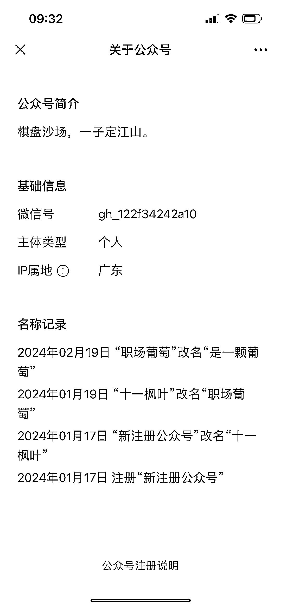
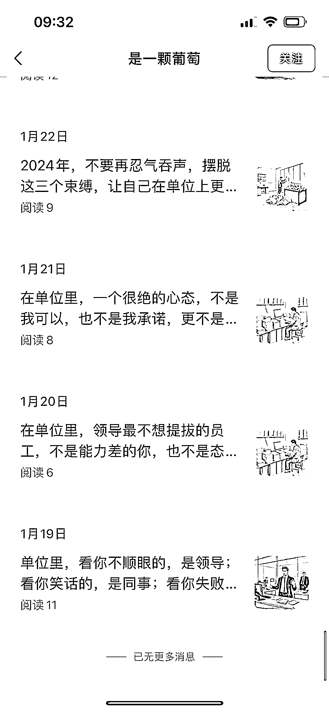
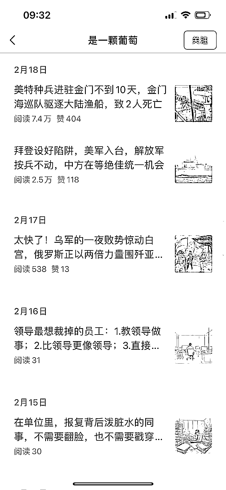
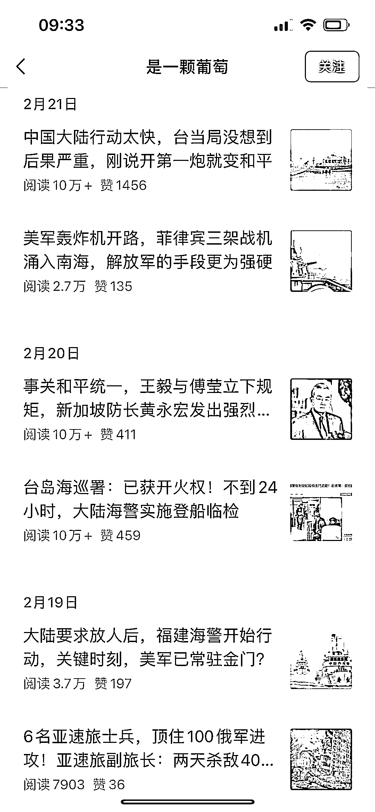
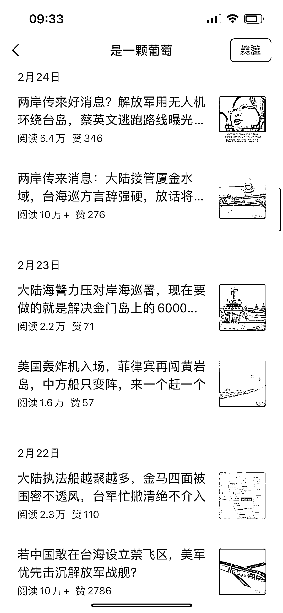
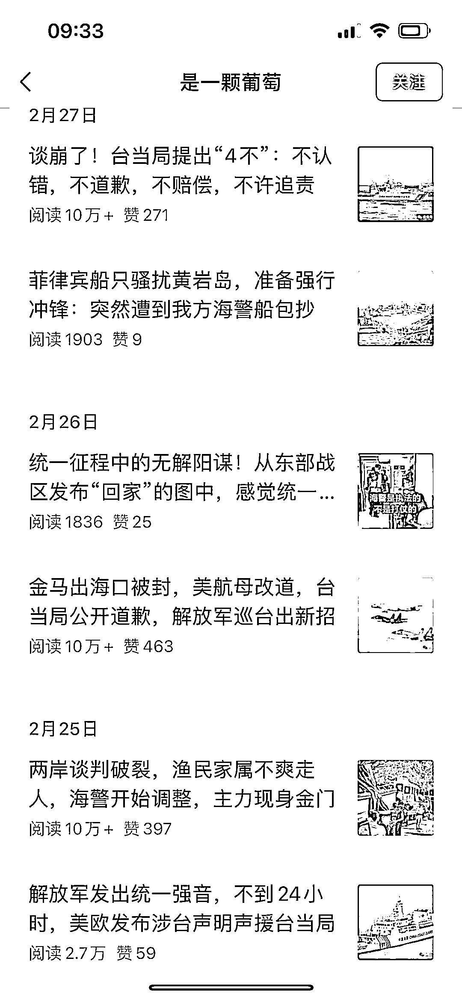
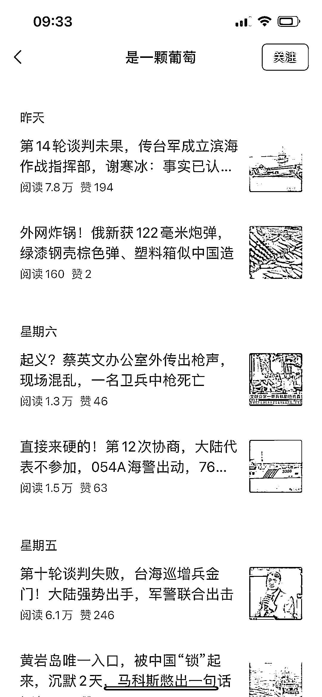

# 2024 年 1 月 17 日注册的公众号，从职场转向军事赛道，迅速爆红

> 原文：[`www.yuque.com/for_lazy/xkrm14/xhi78vzztxx9uzzt`](https://www.yuque.com/for_lazy/xkrm14/xhi78vzztxx9uzzt)

作者： 林希

日期：2024-03-04

点赞数：**75**

* * *

正文：

2024 年 1 月 17 日注册的公众号，1 月 19 日发布第一篇文章，刚开始写职场。2 月 17 日转了军事赛道，2 月 18 日就爆了，2 月 20 日开始 10w+，共 8 篇 10w+，其他文章数据也不错。

* * *

评论区：

仰仰 : 军事题材不太好把控啊，圈友们有啥好的建议[呲牙][呲牙]

余焕 : 这怎么变现呢？商业化效率高不高？

韬晦 : 流量主收益

A0～晓枫 : 为什么我看见很多不错的流量主账号都是个人订阅号呢？？企业或者个体的号不行吗？

Take : 同问

韬晦 : 一般来说个人号的流量更好

Denggh : 这个题材比较敏感，容易丢广告

* * *

公众号懒人搜索，懒人专属群分享