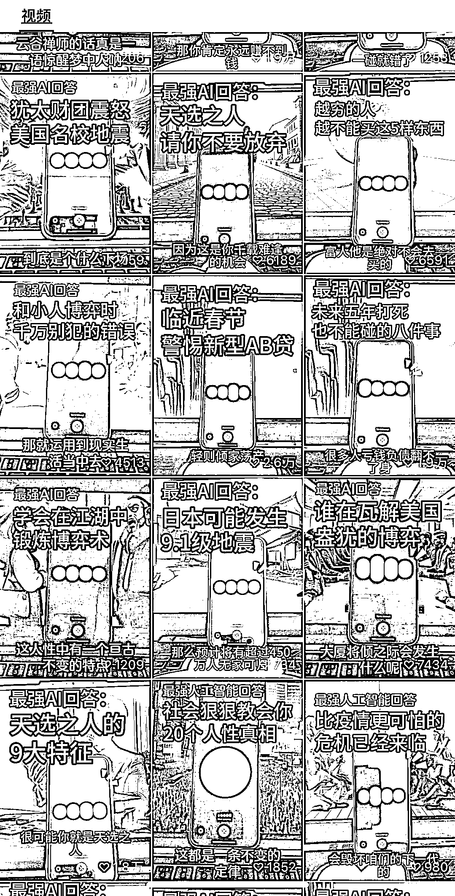
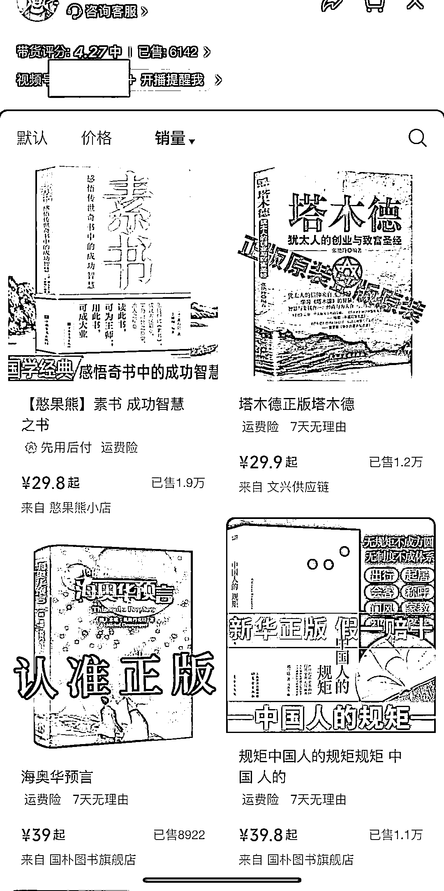
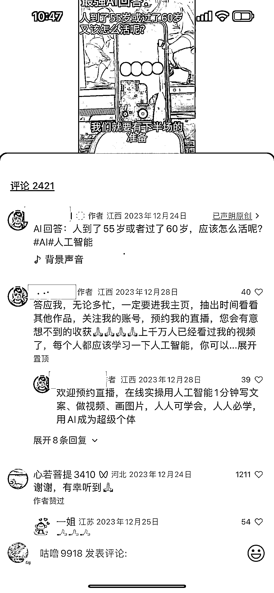

# 视频号 Ai 短视频带货项目：创新玩法带来丰厚盈利空间

> 原文：[`www.yuque.com/for_lazy/xkrm14/dllicpvik401i482`](https://www.yuque.com/for_lazy/xkrm14/dllicpvik401i482)

作者： 易水

日期：2024-03-04

点赞数：**65**

* * *

正文：

平台和项目：视频号 Ai 短视频带货项目 新的玩法：通过 chatGPT 问答，制作爆款视频，进而挂橱窗带书 盈利空间：这个账号短短两三个月时间，已出 6100 多单

* * *

评论区：

想换个昵称 : 请问有人知道他用的是个什么软件么[皱眉]

阿 : 看起来是 chatgpt

易水 : 个人认为：用 chatgpt4.0 最好，其次是 3.5，还可以是国内 Ai。不管用哪个，都要调教好 gpt，另外，挂橱窗的选品也很重要

易水 : 没想第一次发风向标就中标了！多谢亦仁大佬[抱拳][抱拳]

想换个昵称 : 我也认为应该是用的 gpt 生成的内容，但是这个语音我怎么感觉是通过内容生成 Ai 语音剪辑上去的，我看可以直接对话的 App 市面上还挺少的，不晓得猜的对不对

易水 : GPT 的语音对话就是这个声音，我看到有的账号，用其他声音合成的对话效果就不太好

想换个昵称 : 啊，这样哦 感谢

* * *

公众号懒人搜索，懒人专属群分享