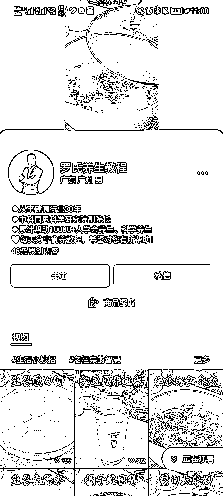
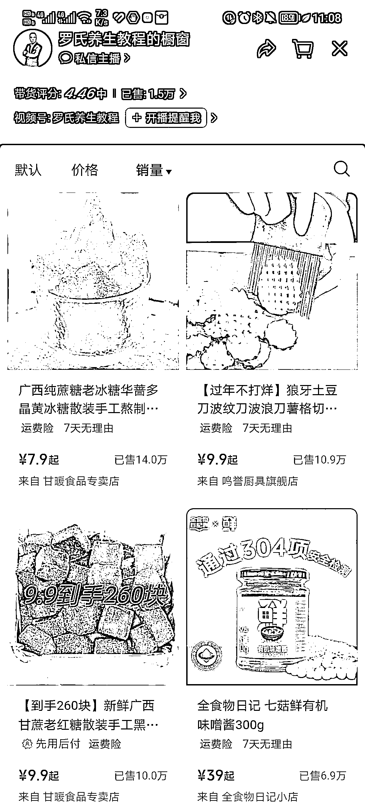
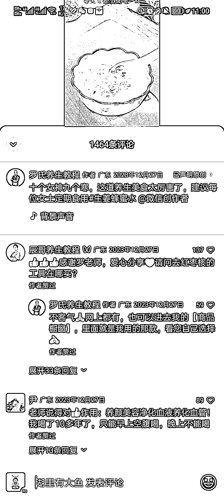
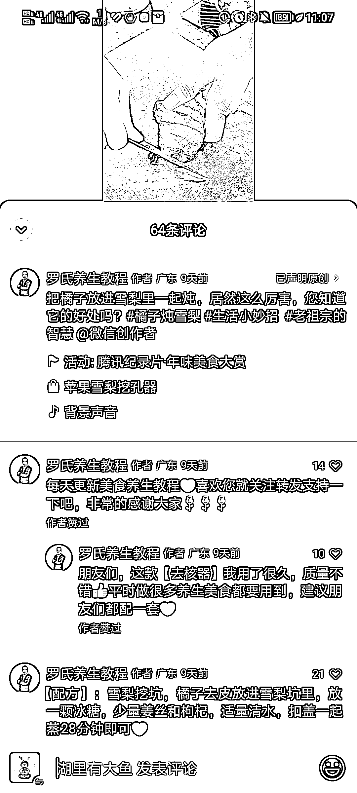

# 视频号卖制作养生茶的周边工具和原材料，盈利空间可观

> 原文：[`www.yuque.com/for_lazy/xkrm14/gdf5o2w5gg1e3rwb`](https://www.yuque.com/for_lazy/xkrm14/gdf5o2w5gg1e3rwb)

作者： 沐风

日期：2024-03-04

点赞数：**50**

* * *

正文：

平台和项目：视频号卖制作养生茶的周边工具和原材料 新的玩法：发布自己制作土方养生茶的过程视频，评论区引导用户到商品橱窗购买工具
盈利空间：现在这个账号的商品橱窗内商品上架 28 款，其中 10 款销量基本都有几万单

* * *

评论区：

* * *

公众号懒人搜索，懒人专属群分享