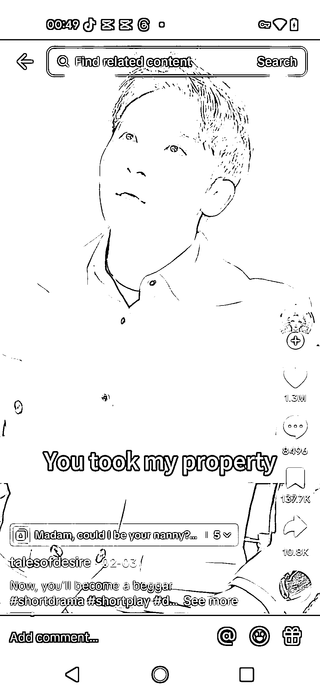
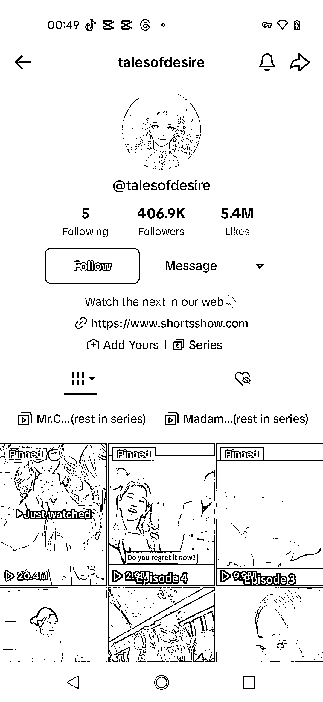
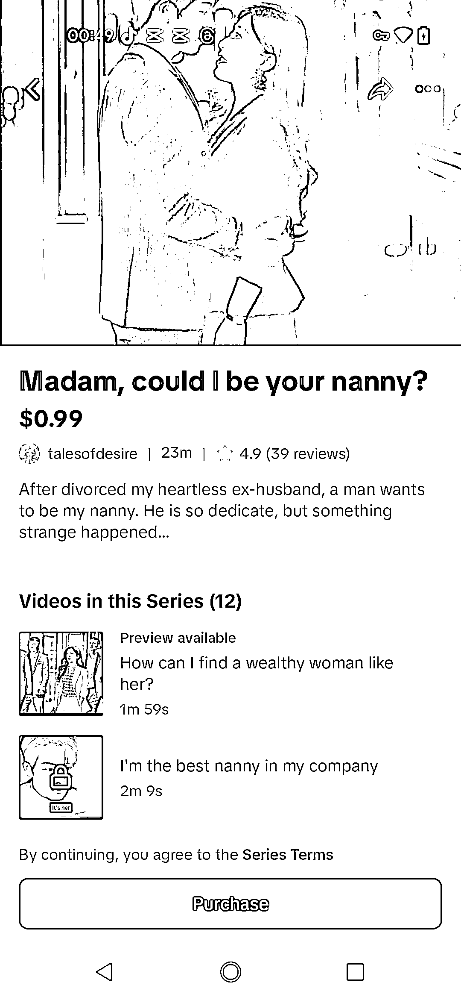

# 利用 tiktok 国内中文短剧赛道，通过修改字幕和剪辑发布短篇视频

> 原文：[`www.yuque.com/for_lazy/xkrm14/gyl25we8t3nogcbg`](https://www.yuque.com/for_lazy/xkrm14/gyl25we8t3nogcbg)

作者： 平凡

日期：2024-03-04

点赞数：**52**

* * *

正文：

赛道+垂类项目：tiktok 国内中文短剧，只修改字幕，然后把短剧剪辑成 10+短篇，上传到序列，然后发布视频的带上这个序列链接，用户喜欢可进行购买，就跟买商品一样方便，重点是一看到好的短剧，看了一篇好看，脑热很容易就购买了，并挂连接序列还有好处，就不用跳转，也不用被抽成；目前看到好几个都是 10 多部加起来 25 分钟左右，挂 0.99 美金，也可以卖出几百份。另外就是 tk 的序列，是不会审核是否有版权的。这个我亲身试过。目前 tk 的序列正在升级中。这个图片账号观看量就上百 W，序列视频就 25 分钟多，也卖出了很多。评价也很不错。都可以作为宣传。

* * *

评论区：

蕉太狼 DP : 请问在 TK 上如何找到这个入口

青云 : 正在做这个项目，就是系列升级的太久了，就是起号没之前那么快了。

平凡 : 序列升级，应该有近 1 个多月了。现在升级结束时间也是未定。

仰仰 : 同问，序列怎么申请[呲牙][呲牙]

阿拉善¹（抖音店群） : 您好，可以加个联系方式吗

平凡 : 这个需要粉丝达到一定程度好像是 1w 粉丝，才可以开通

青云 : forwatd001

* * *

公众号懒人搜索，懒人专属群分享