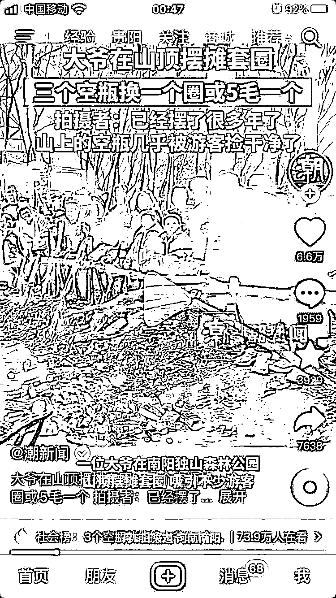

# 利用塑料瓶换套圈的创新商机，解决垃圾乱扔问题

> 原文：[`www.yuque.com/for_lazy/xkrm14/hhy7kukkac5804ni`](https://www.yuque.com/for_lazy/xkrm14/hhy7kukkac5804ni)

作者： Yhx

日期：2024-03-06

点赞数：**100**

* * *

正文：

在山上让游客捡三个塑料瓶换套圈一个，或者直接 5 毛购买一个套圈。一是大爷不用自己去捡塑料瓶，摆个摊位让大家自己把塑料瓶运过来，自己做收集处理，二是利用套圈吸引的人群，塑料瓶没了就直接付费套圈。生意之外还能解决一部分垃圾乱扔问题。思维可以发散到小区，用家里的闲置衣服来参加什么游戏，找好衣服处理厂，一样可以做大。

* * *

评论区：

夏天 : 这思路牛逼啊

* * *

公众号懒人搜索，懒人专属群分享