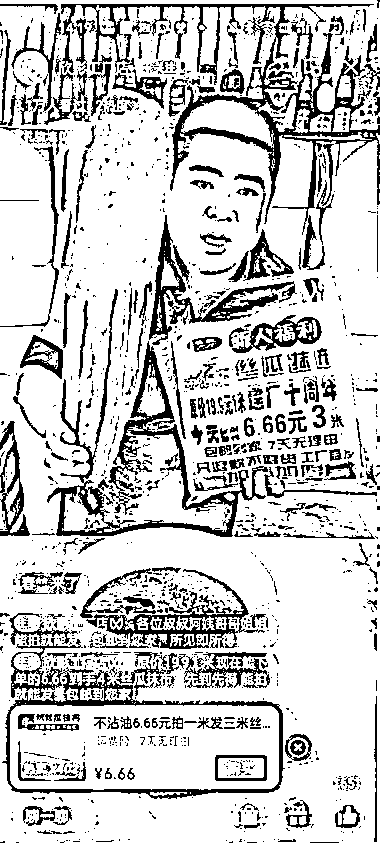
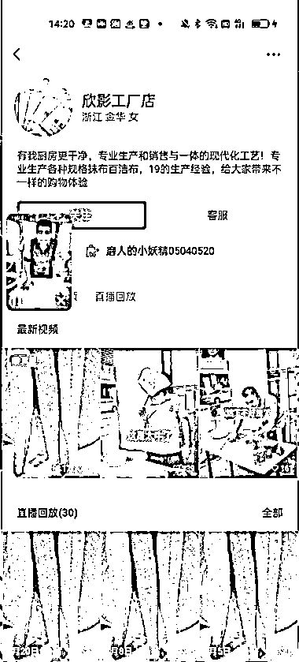
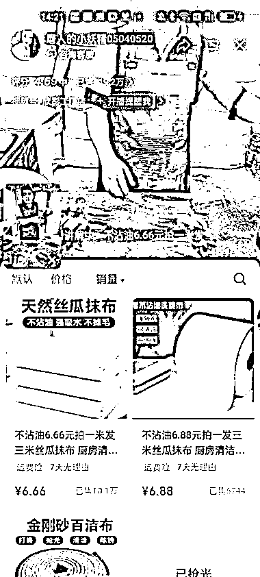

# 丝瓜抹布直播带货，账号销量 19.2 万单，拆解案例分析

> 原文：[`www.yuque.com/for_lazy/xkrm14/lgmasex6zpylkamg`](https://www.yuque.com/for_lazy/xkrm14/lgmasex6zpylkamg)

作者： 李诚 Sonic

日期：2024-03-06

点赞数：**86**

* * *

正文：

【视频号带货案例拆解】丝瓜抹布单场 402 单，账号销量 19.2 万单 【账号名称】欣影工厂店 【账号属性】无认证，百货博主 【带货方式】直播
【账号内容】产品展示使用方法和前后对比，直播间互动和话术引导停留，再通过底价不断引导成交，密集成交获得平台持续推流。 【带货产品】百货产品
【单场单品销量】丝瓜抹布，单场销量 402 单（仅截图时间，单场预估 1000+） 【橱窗分数】4.69 【橱窗总销量】19.2w

* * *

评论区：

三木森 : 3.7 下午看橱窗 21.9w 了，这转化杠杠的 直击生活的痛点

浩瀚星辰 : 在我们小的时候农村就是用这个洗碗，用竹篾洗锅

刘继春 : 我两年前选的品[发呆]

李诚 Sonic : 是的，截图有一小段时间，不过证明转化非常棒。

李诚 Sonic : 是的是的，在视频号人群特别喜欢。

李诚 Sonic : 经久不衰，很多品每年到了季节都会爆，换个平台依然也会爆。

仰仰 : 我也买过，确实挺好用的[呲牙][呲牙]

* * *

公众号懒人搜索，懒人专属群分享