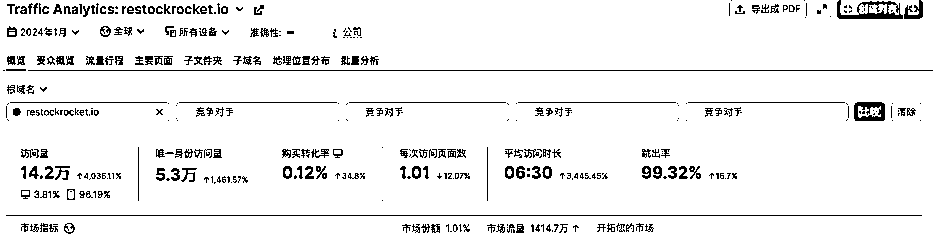
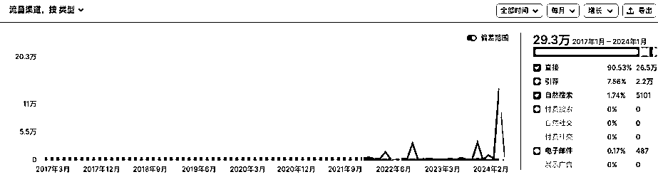

# 程序员技能套现的好地方：卖课和开发 Shopify APP 网站

> 原文：[`www.yuque.com/for_lazy/xkrm14/io8eht1mximffw4v`](https://www.yuque.com/for_lazy/xkrm14/io8eht1mximffw4v)

作者： 橘子小姐

日期：2024-03-05

点赞数：**56**

* * *

正文：

Shopify APP 和卖课，教人开店和开发 APP 网站才是程序员技能套现的好地方 上有一个用户在售卖他的 Shopify app 报价 9W ，这个
APP 有一个官网和 Shopify app store app 页面，我查询了一下他的官网的流量情况如图一。 服务器和数据库成本
它的成本就是一个服务器和一个数据库的成本，如果用 DigitalOcean 25 刀一个月的成本，25 刀个成本可以跑 3 个 Shopify APP 。
流量成本：图二 他没有购买任何广告流量，全部都是直接流量，我再查了它的反向链接，可以看到这个作者的流量都来源于 shopify app store ，他做了
3 个 APP 。 利润 所以我评估他这个卖 9W 刀的 APP 每个月应该可以给他创造 800-1200 的利润。 总结 对于卖实体产品来说，做
shopify app 和主题的开发，更加能发挥出程序员的优势。目前国内非常少 shopify app 上架到 shopify app store
，这种开发是有门槛的，但是他的好处就是收益高。其实每个 shopify app
的功能都很少，作为副业来说是非常值得投入的，我最近认识了一个台湾的兄弟，他是做 A/B testing Shopify APP
的收益非常可观，他目前只有他一个人，他上线 4 个月，他已经积累了 20 个左右的 shopify plus 的客户了，他产品的定价在 135 刀一个月。

* * *

评论区：

* * *

公众号懒人搜索，懒人专属群分享