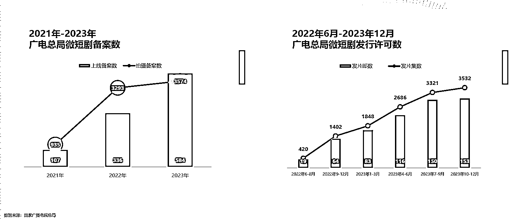
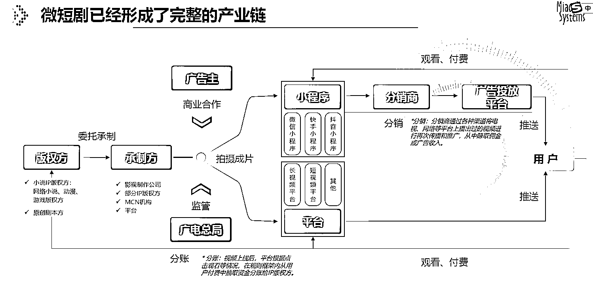
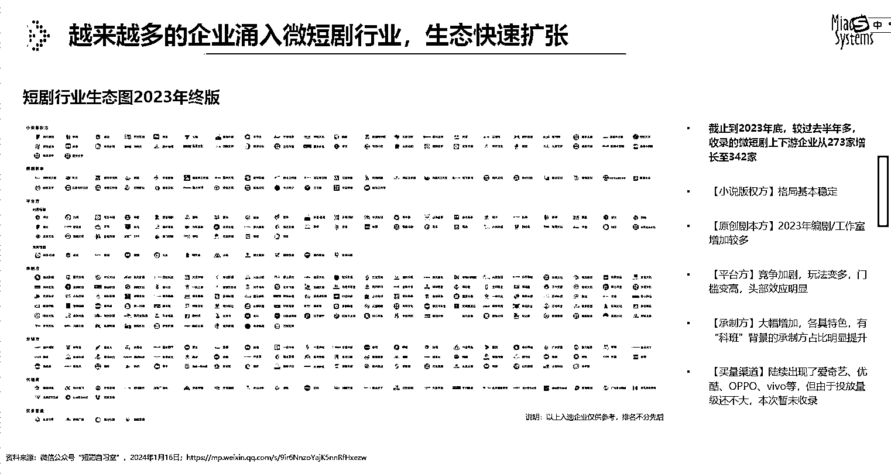
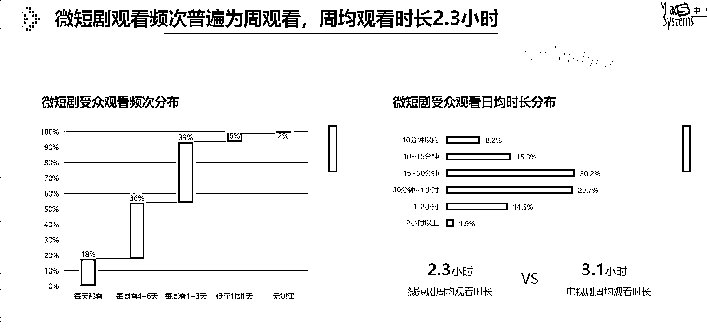
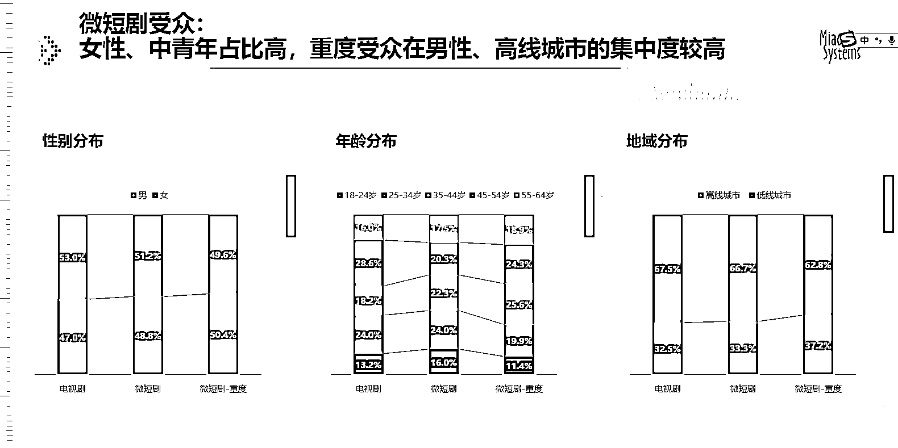
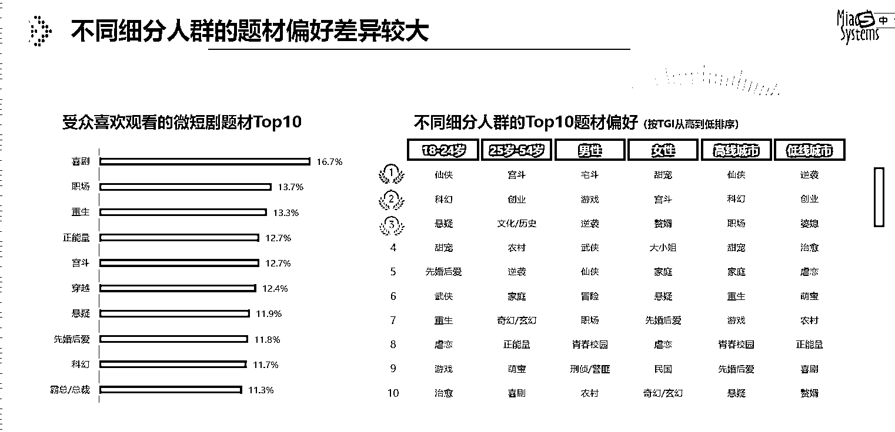

# 微短剧数量爆发式增长，2024 年有望进一步扩大

> 原文：[`www.yuque.com/for_lazy/xkrm14/io9vw82r60inls21`](https://www.yuque.com/for_lazy/xkrm14/io9vw82r60inls21)

作者： 张波

日期：2024-03-06

点赞数：**49**

* * *

正文：

微短剧数量爆发式增长，感觉 2024 年还可以进一步扩大。 微短剧受众：女性、中青年占比高，重度受众在男性、高线城市的集中度较高。

* * *

评论区：

敢拼，世界就是你的！ : 厉害了👍

* * *

公众号懒人搜索，懒人专属群分享