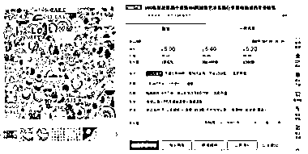

# 在 Etsy 上卖贴纸，利润率高，但需注意侵权问题

> 原文：[`www.yuque.com/for_lazy/xkrm14/gv4qgiwqt9prwkai`](https://www.yuque.com/for_lazy/xkrm14/gv4qgiwqt9prwkai)

作者： Tang

日期：2024-03-04

点赞数：**43**

* * *

正文：

在 Etsy 上卖贴纸，利润率较高。都是从 1688 上进货的，比如以下的贴纸， 25 张卖 5.95 英镑 50 张卖 9.95 英镑
在 1688 上进货 100 张仅仅 5 块多人民币，贴纸轻，运费低。 但是一定要注意侵权问题，一两张侵权贴纸可能会导致这个版本贴纸无法售卖，甚至店铺被封。

* * *

评论区：

安吉 : 想了解现在还能开店吗国人

希声 : 不行

* * *

公众号懒人搜索，懒人专属群分享