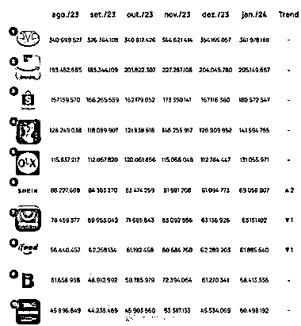
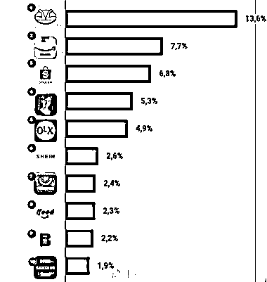

# 美客多成为巴西电商领先者

> 原文：[`www.yuque.com/for_lazy/xkrm14/xoak8hvwgvbuxcxo`](https://www.yuque.com/for_lazy/xkrm14/xoak8hvwgvbuxcxo)

作者： David Tree*

日期：2024-03-04

点赞数：**40**

* * *

正文：

看最新数据，美客多势头很猛，巴西电商顶流，访问量超过 3.6 亿次，属于断层领先！做南美市场尤其是想进军巴西市场的圈友，可以多关注参与其中

* * *

评论区：

世江 : 这个数据是什么平台

* * *

公众号懒人搜索，懒人专属群分享