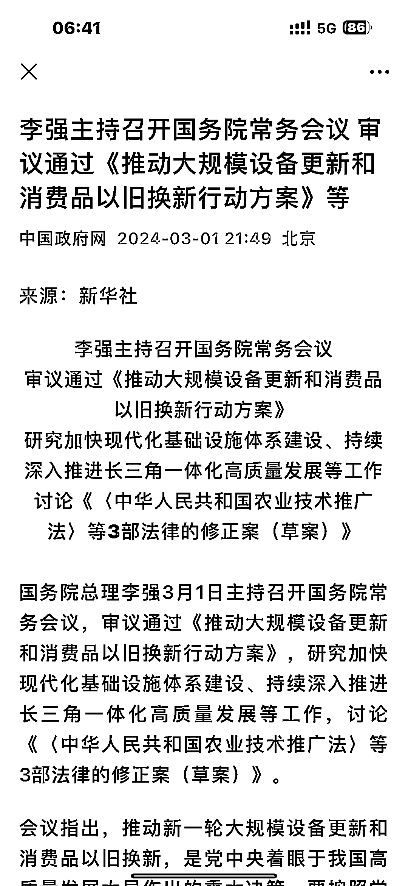
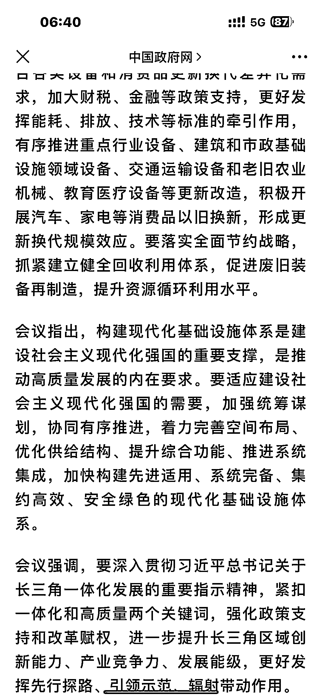

# 国务院通过《推动大规模设备更新和消费品以旧换新行动方案》

> 原文：[`www.yuque.com/for_lazy/xkrm14/er6kme58dn7qk9g4`](https://www.yuque.com/for_lazy/xkrm14/er6kme58dn7qk9g4)

作者： Ahaaa🥳

日期：2024-03-04

点赞数：**35**

* * *

正文：

《推动大规模设备更新和消费品以旧换新行动方案》 3 月 1 日李强主持召开国务院常务会议，审议通过此方案。
政策有利于做回收再利用、资源循环、废旧装备回收再造等行业。同时，做要素市场的都有一定机会做业务调整。

* * *

评论区：

* * *

公众号懒人搜索，懒人专属群分享