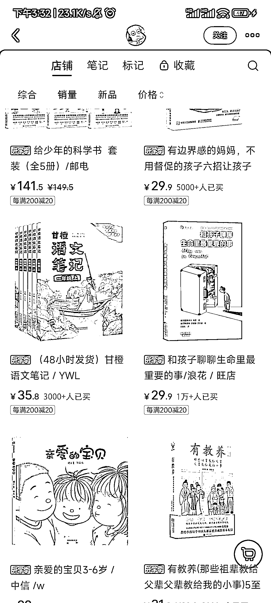
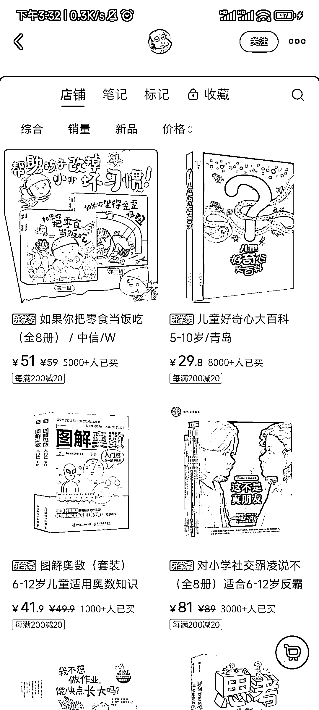

# 小红书儿童图书类目销量最高，薄利多销的选择

> 原文：[`www.yuque.com/for_lazy/xkrm14/iygi970xm7cd2ulx`](https://www.yuque.com/for_lazy/xkrm14/iygi970xm7cd2ulx)

作者： 刘君峰

日期：2024-02-29

点赞数：**64**

* * *

正文：

小红书选品，儿童图书类目，销量最高的 1w+,单价不高，走薄利多销的路子。图文笔记形式，实拍模仿难度不大。

* * *

评论区：

多闻 : 这种书利润比较低，要达到她这个拍摄效果也不容易

！！！ : 主要是利用家长望子成龙成凤的心理，卖教辅，让孩子接受到好点的教育，可以利用这一心理，不只是是去买书，可以用这些心理去卖些其他衍生物

* * *

公众号懒人搜索，懒人专属群分享