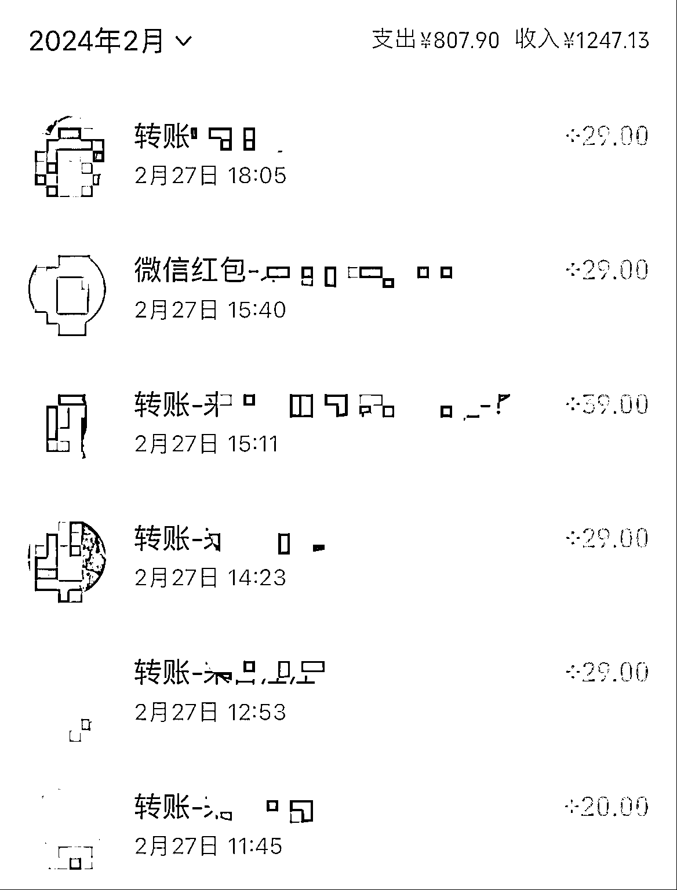

# 抖音、小红书成为教辅类虚拟资料销售，开学季家长需求增长

> 原文：[`www.yuque.com/for_lazy/xkrm14/ammd1919amq8rf2v`](https://www.yuque.com/for_lazy/xkrm14/ammd1919amq8rf2v)

作者： 三七

日期：2024-02-29

点赞数：**54**

* * *

正文：

抖音、小红书卖教辅类虚拟资料 开学季，家长需求有增长 图片来自我的交流群

* * *

评论区：

小林 : 可以链接一下吗

小木 : 怎么引流？

* * *

公众号懒人搜索，懒人专属群分享