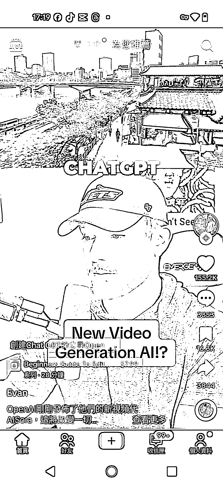
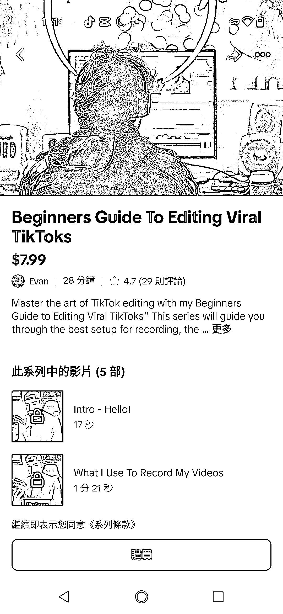

# TikTok 新手指南：剪辑爆火视频的秘诀

> 原文：[`www.yuque.com/for_lazy/xkrm14/stt24wicp6fqcwb5`](https://www.yuque.com/for_lazy/xkrm14/stt24wicp6fqcwb5)

作者： 平凡

日期：2024-02-28

点赞数：**46**

* * *

正文：

赛道+垂类项目：tiktok 新手指南，剪辑爆火视频。 主要通过分享讲解 open ai sora
文本视频，来买虚拟资料，点赞超 15w,而粉丝才 10w 多。一份 28 分钟的资料，买 7.99 美金。看来国外对于 tiktok 的剪辑视频课程也是很火的。

* * *

评论区：

* * *

公众号懒人搜索，懒人专属群分享