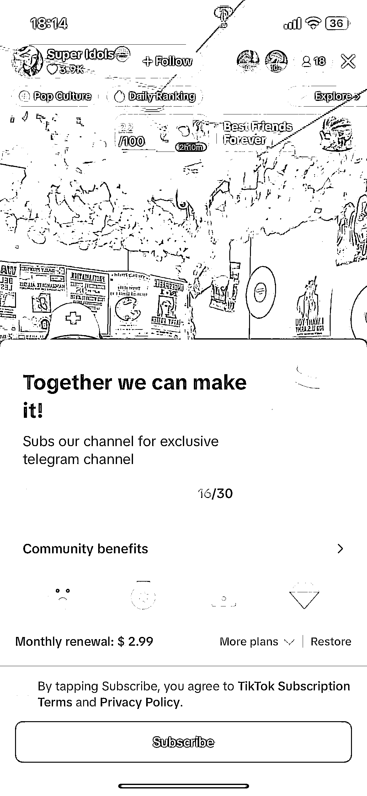

# Tiktok 娱乐直播：新方向和变现方式的风向标

> 原文：[`www.yuque.com/for_lazy/xkrm14/tz1u9g8o44r2qlue`](https://www.yuque.com/for_lazy/xkrm14/tz1u9g8o44r2qlue)

作者： 卫

日期：2024-02-28

点赞数：**46**

* * *

正文：

平台：Tiktok 项目：Tiktok 娱乐直播 新的方向：去年团播（多人娱乐直播）在国内抖音火了，所以最近几个月在海外抖音上很多都是直接搬过去 新的变现：
海外抖音赚钱主要靠两个，一个是礼物打赏，另一个其实是重点 就是 订阅（subscription）我之前见过光这个一月收益在 10 几万的。
下面这个是今天收了 16 个 2.99 美金的的，但是这个是每个月自动扣费的。 做 Tiktok 娱乐直播应该感谢下我，因为大部分直播间都没有开通这个。
只能说你们的运营能力有待加强。因为这个功能其实已经开通 1 年多了 #风向标

* * *

评论区：

快乐柠檬 : 这个对语言要求高吗

卫 : 这个不说话，是跳舞的

k. : 录播吗？

* * *

公众号懒人搜索，懒人专属群分享