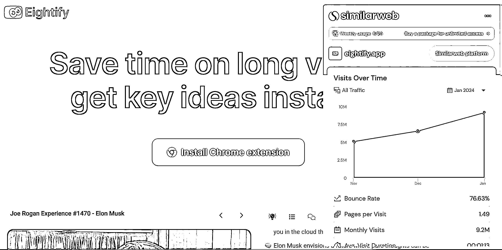

# AI Youtube 总结插件：用户数和流量持续增长

> 原文：[`www.yuque.com/for_lazy/xkrm14/ae18pl5fw2nqgtlz`](https://www.yuque.com/for_lazy/xkrm14/ae18pl5fw2nqgtlz)

作者： 苓枫

日期：2024-02-26

点赞数：**59**

* * *

正文：

AI Youtube 总结插件 分类：AI 工具 网址： -----2023 年 6 月 13 日----- 流量：44.9 万/月 用户：5000+
流量增速：20 万/月 价格：3.95 刀/月 介绍： 一款总结 youtube 的插件，这么大的用户数付费肯定也差不了 ----2023 年 10 月 19 日----
流量：230 万/月 用户： 120,539 --------------- ----2024 年 02 月 26 日---- 流量：920 万/月 用户：
166,862[`eightify.app/`](https://eightify.app/)

* * *

评论区：

果粒陈 : 我也做了一个差不多功能的站[呲牙]

自律更自由 : 有没有能下 YouTube 的网站

快乐柠檬 : 效果怎么样

* * *

公众号懒人搜索，懒人专属群分享