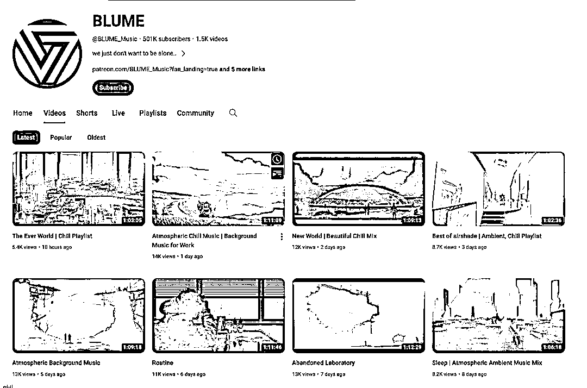
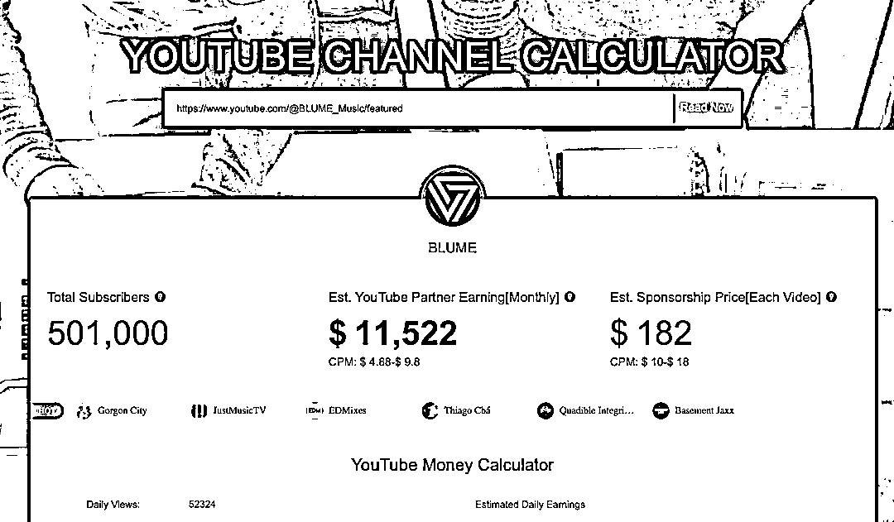

# AI 制作漫画视频，每天输出，广告费可达 2000 美元

> 原文：[`www.yuque.com/for_lazy/xkrm14/agf0o6pknz0zvzon`](https://www.yuque.com/for_lazy/xkrm14/agf0o6pknz0zvzon)

作者： SL

日期：2024-02-29

点赞数：**91**

* * *

正文：

AI 做一个漫画图配上免版权的音乐做成一个 plyalist 油管视频。playlist 里面的音乐需要是一个风格的，比如说悲伤的，安静的。做这样的一个视频比较简单可以持续每天持续输出。每天的视频播放量如果能达到 1000 左右，一个月视频广告费（AdSense）大概能 2000 美刀左右

* * *

评论区：

乐行 : 你好，视频播放量有比如停留时长，互动这些要求吗

SL : 油管是根据你做视频的类型来确定你每 1000 个播放量能拿到多少的广告费，那么你的互动，比如说点赞或者转发或者评论，会影响到你的播放量，也会影响到你每 1000 个播放量有多少的广告费。停留时长会决定算法给多少人推荐你的视频

乐行 : 收到，感谢解答

SL : 没事！

晨旭 : 做油管的话，需要独立 ip 吗这种说法吗

To get her : 很好奇这种几小时的视频如何快速上传，我自己一个 4k 的 30 分钟就传了 4 小时，我用的还是 200M 宽带➕4060 配置

SL : 独立 ip 是指个人 ip 吗

SL : 国内宽带再大也对外网有限制的，我家用 1000 的我也还感觉挺慢的😂 我一般都是晚上开着电脑上传

* * *

公众号懒人搜索，懒人专属群分享