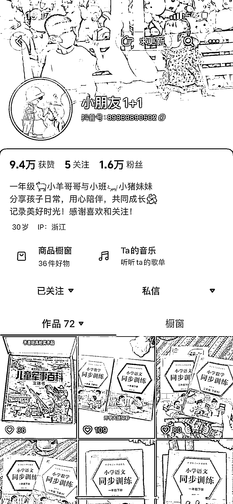
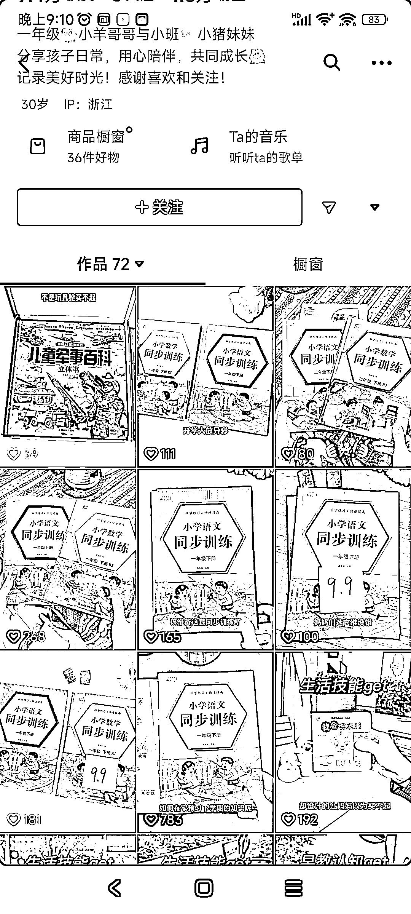
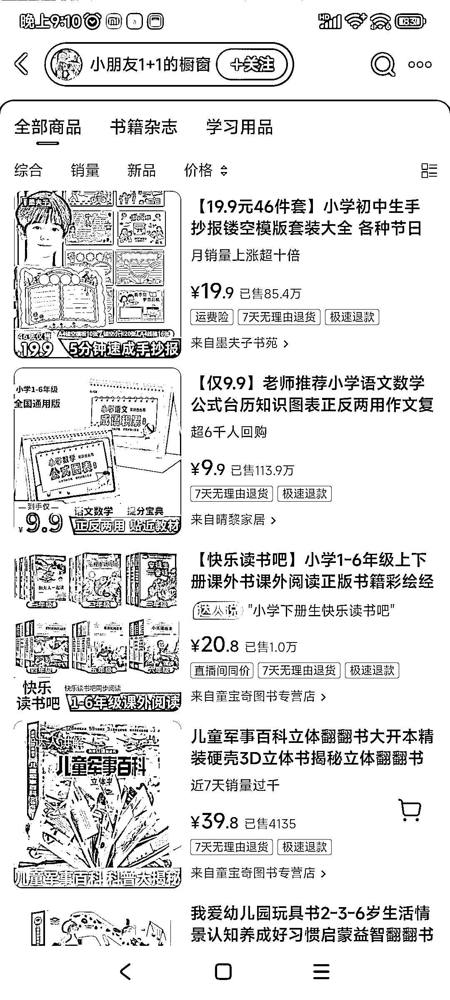

# 抖音电商：满足孩子学习需求的教辅产品走红

> 原文：[`www.yuque.com/for_lazy/xkrm14/lrd4wro06t87k909`](https://www.yuque.com/for_lazy/xkrm14/lrd4wro06t87k909)

作者： 画说

日期：2024-02-27

点赞数：**51**

* * *

正文：

赛道+垂类项目：抖音电商 目标人群：孩子家长 需求：满足家长不知道给孩子买怎样的教辅促进学习
平台：抖音平台，发布图书翻阅视频，配合语音和文字解读，一本图书反复拍反复发，持续得到曝光 盈利空间：最高的一个台历，小朋友语文数学的，已经出了 113 万单

* * *

评论区：

画说 : 谢谢老大

小孙 : 怎么看账号是否投流

快乐柠檬 : 113 万单是全部这个账号卖的吗？还是所有带这个货的达人的累计销量

画说 : 现在看的应该是店铺橱窗

冬冬李 : 看整体的点赞比例，和发布的视频数量。点赞异常值较高的视频是有其他动作的。图书类的佣金较高，付费的投产比合适。

画说 : 感谢

时习姥姥 : 是所有达人一起卖的，不是一个账号的销量

* * *

公众号懒人搜索，懒人专属群分享