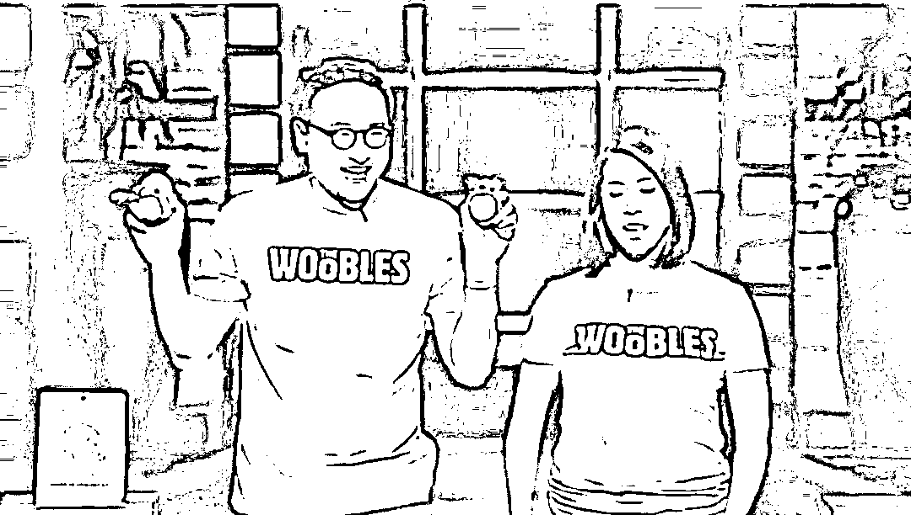
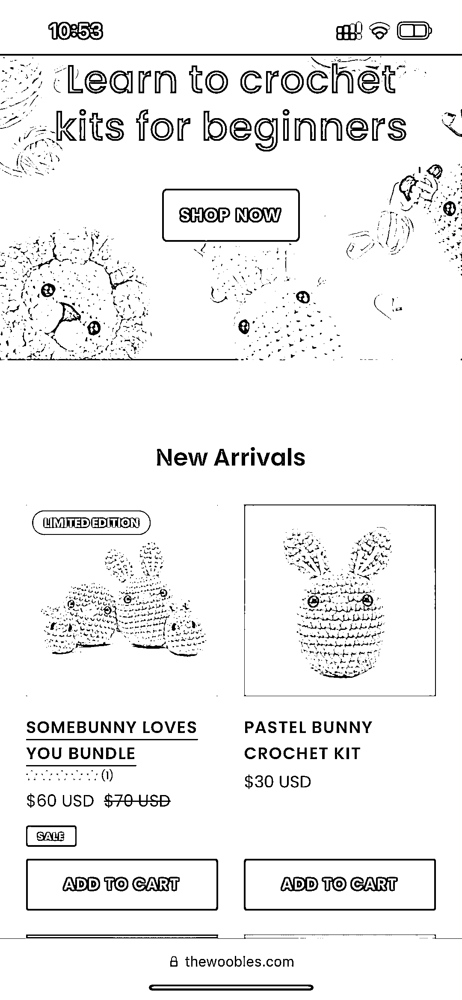
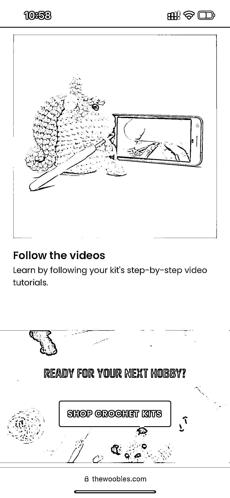
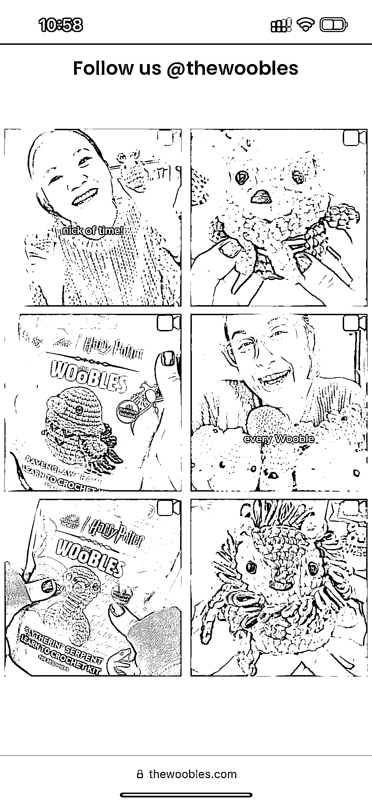

# 华裔夫妇成功将几美元的产品卖到几十美元的秘诀是什么？

> 原文：[`www.yuque.com/for_lazy/xkrm14/ettlq663c5orr5mz`](https://www.yuque.com/for_lazy/xkrm14/ettlq663c5orr5mz)

作者： amanda_win*

日期：2024-02-26

点赞数：**90**

* * *

正文：

Thewoobles 是一家卖毛钱卖娃娃的独立站，月浏览量 200 多万，年销售额达到三五百万美金。做娃娃的人很多，为什么这对华裔夫妇可以把三五美金的产品卖到几十美金甚至一百美金？这对夫妇最聪明的一点是，把产品做成了一种体验，通过简单的教程和提供好的材料包，能够轻松地完成一个可爱的布偶玩偶，可以作为礼物送给朋友。而且具有很强的社交属性，大家很乐意在社交媒体上分享。成品很酷炫，复购率很高。客户感觉多了一项技能，心理得到了巨大的满足，所以他们愿意付出大几十美金的额外附加值。这对于跨境卖家的启发是卖产品的同时要重视用户的体验价值和情绪价值。

* * *

评论区：

amanda_win* : 感谢亦仁大大[哇]

快乐柠檬 : 类似简单版的乐高？

* * *

公众号懒人搜索，懒人专属群分享