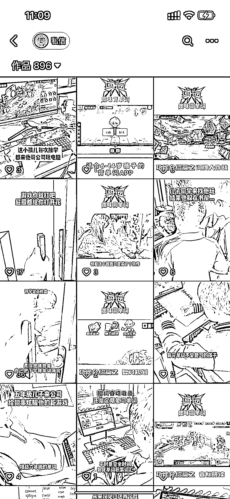
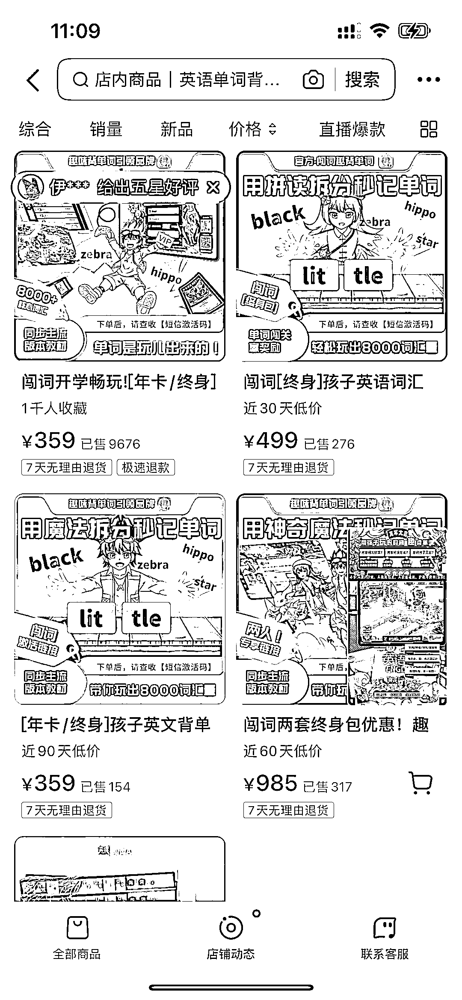
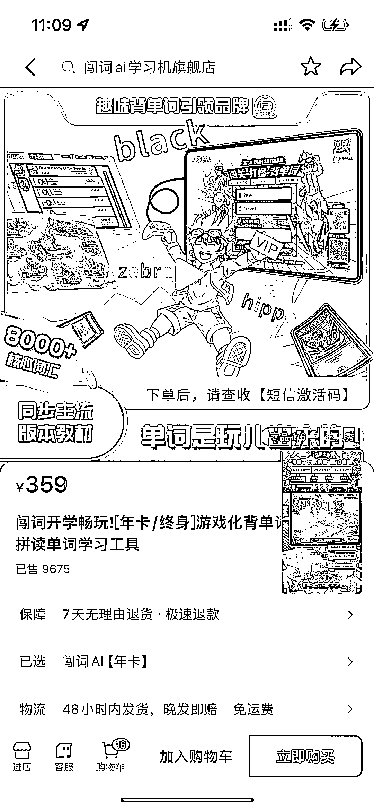

# 教培行业松动管控，背单词游戏软件销量接近 1W 单，变现 3、400W

> 原文：[`www.yuque.com/for_lazy/xkrm14/krwh2uohyu3dsu4r`](https://www.yuque.com/for_lazy/xkrm14/krwh2uohyu3dsu4r)

作者： 北辰

日期：2024-02-26

点赞数：**86**

* * *

正文：

随着教培行业管控的松动，相关软件、课程的需求会有更大的释放。
一款将背单词与游戏结合的软件，年卡 359，永久卡 499。橱窗累计销量接近 1W 单，变现 3、400W。

* * *

评论区：

🎎余家大 S : 我家有买这个软件来用

北辰 : 刚刚也买了，小朋友兴趣很大，刷单词刷的飞起。

* * *

公众号懒人搜索，懒人专属群分享