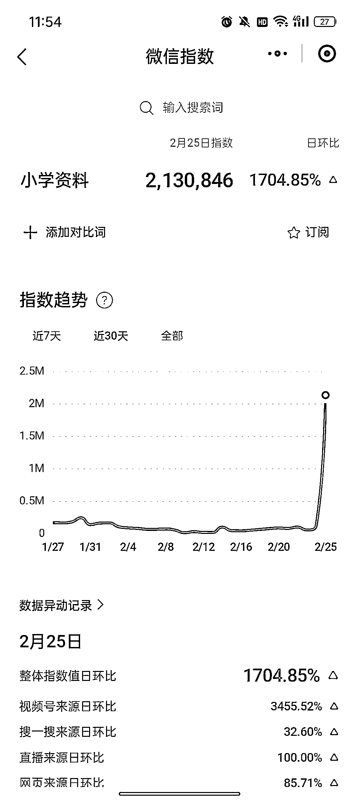

# 开学前的搜索指数飙升，视频号成为最快增长平台

> 原文：[`www.yuque.com/for_lazy/xkrm14/nzsdh07lxf9t411x`](https://www.yuque.com/for_lazy/xkrm14/nzsdh07lxf9t411x)

作者： 倾听晚风

日期：2024-02-26

点赞数：**78**

* * *

正文：

发现一个风口机会，临近开学，小学资料最近的搜索指数一下子飙升了很多很多，但是指数增长最快的是在视频号
做个延伸，不仅仅是小学资料，小学到高中的资料都有机会，以及各个大学专业的垂类资料，以及今年需要考试的资料，个人预测一下今年 9 月份，8 月底的时候，关于学习资料的指数还有可能会迎来一波暴涨。

* * *

评论区：

* * *

公众号懒人搜索，懒人专属群分享