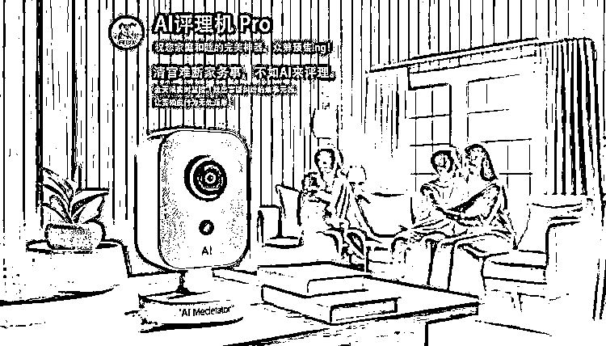

# AI 应用场景，AI 评理机 pro

> 原文：[`www.yuque.com/for_lazy/xkrm14/ccmytouiqucwx433`](https://www.yuque.com/for_lazy/xkrm14/ccmytouiqucwx433)

作者： 杨涛

日期：2024-02-29

点赞数：**99**

* * *

正文：

* * *

评论区：

刘继春 : 公说公有理，婆说婆有理！

流浪虎 : 它的下场应该是被砸[呲牙]

怪力小乔巴 : 想到它评理的画面莫名有点好笑[偷笑]

allen : 被砸了才有复购[机智]

林林 AIGC 写作 : 恭喜涛哥

郑青 m⃢👁-👁⃢ : 这东西好啊，到哪里拿货呢？

* * *

公众号懒人搜索，懒人专属群分享