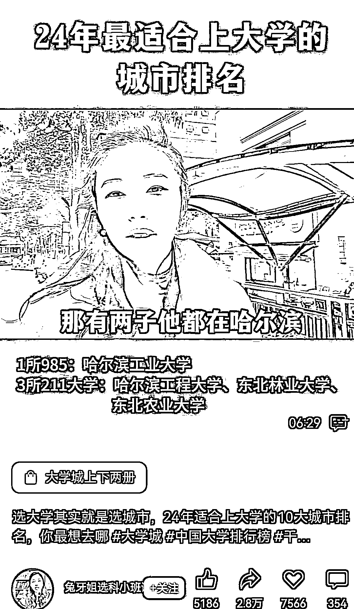
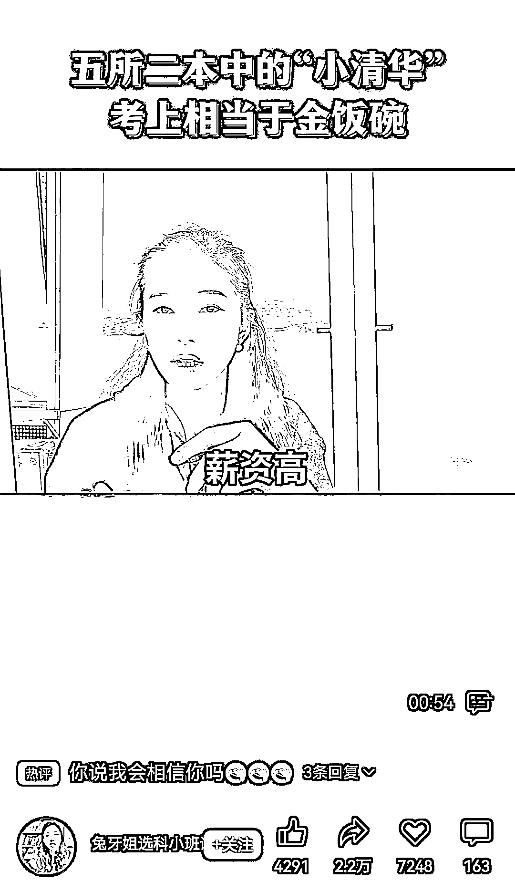
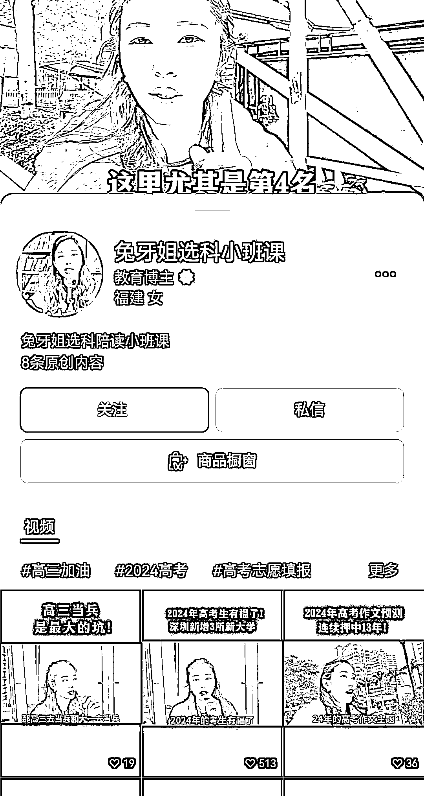
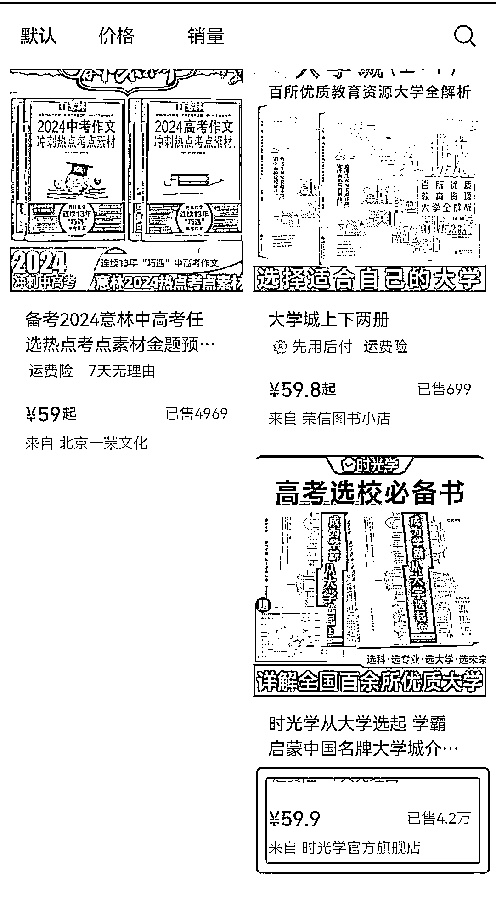

# 高销量的《高考选校必备书》教你如何选大学，淘宝成本仅 32 元

> 原文：[`www.yuque.com/for_lazy/xkrm14/vyctdwrs1ol5u596`](https://www.yuque.com/for_lazy/xkrm14/vyctdwrs1ol5u596)

作者： 花猫（持续早起 300*

日期：2024-02-28

点赞数：**73**

* * *

正文：

讲解如何选大学，或者介绍各大学优劣势，卖《高考选校必备书》，销量非常好，这个赛道人群基数挺大的。淘宝上成本在 32 左右，卖 59.9

* * *

评论区：

花猫（持续早起 300* : 谢谢亦仁大大

小孙 : 对教育赛道的我很有用

花猫（持续早起 300* : OK

* * *

公众号懒人搜索，懒人专属群分享