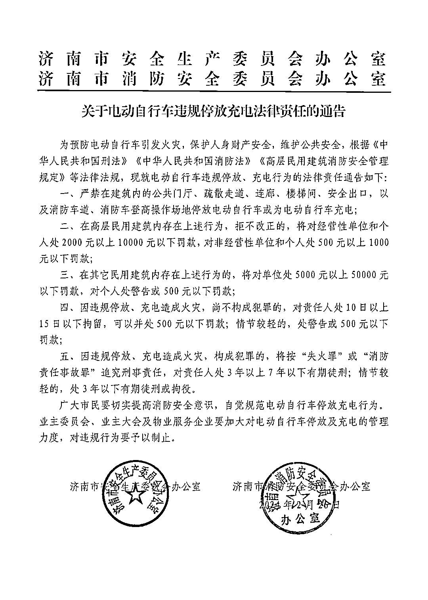
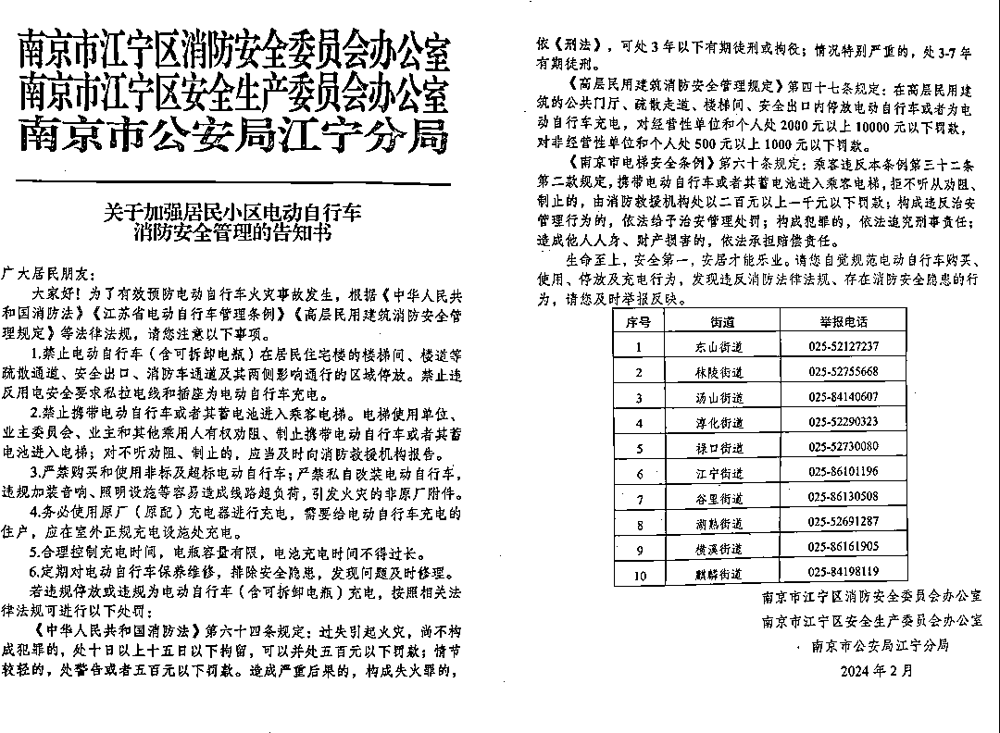

# 南京住宅火灾引发电瓶车进电梯预警需求，一天售出 1 万个监控设备

> 原文：[`www.yuque.com/for_lazy/xkrm14/vd83t6w51zvu56gu`](https://www.yuque.com/for_lazy/xkrm14/vd83t6w51zvu56gu)

作者： 老金说监控

日期：2024-02-28

点赞数：**84**

* * *

正文：

南京住宅火灾，电瓶车进电梯预警的监控非常好卖，昨天一天卖了 1 万个电梯监控。 各地陆续发文了。 感觉这个东西未来会成为小区电梯出货标配。

* * *

评论区：

皕芊 : 这个风向标感觉有戏

Max : 哪里的数据，一万个电梯监控

老金说监控 : 我自己卖出去的

志豪 : 是批量购买（物业）还是个人购买

菜菜 : 1 天卖了 1w 个，离谱

老家贼 : 基本是政府采购

大宁 : 是淘宝吗？

* * *

公众号懒人搜索，懒人专属群分享