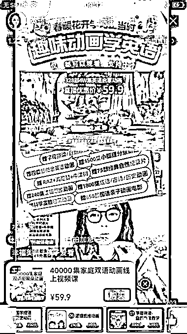
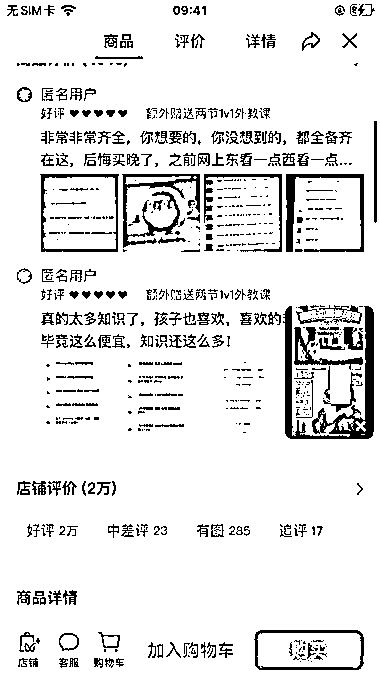
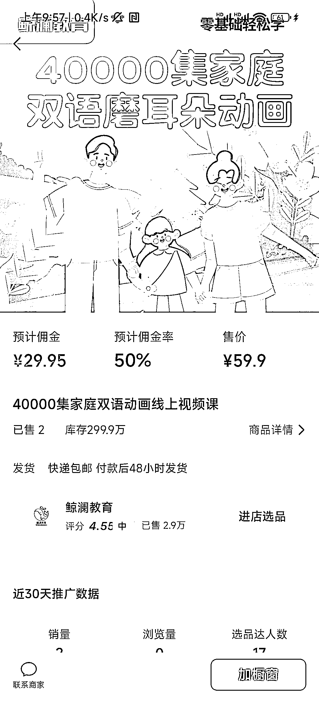

# 虚拟资料幼儿英语项目火热，佣金高达 50%

> 原文：[`www.yuque.com/for_lazy/xkrm14/pgdheg5a9of9y6bx`](https://www.yuque.com/for_lazy/xkrm14/pgdheg5a9of9y6bx)

作者： 曲建伟

日期：2024-02-27

点赞数：**74**

* * *

正文：

虚拟资料幼儿英语项目，依然这么火热。 录播循环播放，场观也很好 1.2 万，能带来直接购买。 除了正常分销的课程，赠送其他电子资料，买 1 赠 12，吸引用户下单。
59.9 的价格，佣金 50%。 百度网盘做为载体，短信发货。 购买成功之后，引导用户加主播微信，额外赠送礼品，还能增加私域。
长期项目，长期可做，复刻简单，把语音提取出来，作为话术即可开播。 自己独立买一份，在其他平台也可以直接复制销售。

* * *

评论区：

小鹿 : 很棒的项目！这也需要去购买版权吧？

曲建伟 : 只是网盘分享

小鹿 : 那开个店直接 100%毛利啊

曲建伟 : 先跑起来，能正常出单，再自己搞

江大虾 : 需要资质才能做

小鹿 : 请教下这种资质如何拿到，是几百部不同的国外动画，还是国内有打包的授权代理

快乐柠檬 : 什么类型的资质？授权吗？

* * *

公众号懒人搜索，懒人专属群分享