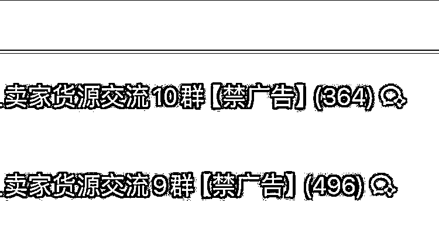

# 电商互赞互刷群聊，高质量商家交流，拥有货源供应商，利润 15w

> 原文：[`www.yuque.com/for_lazy/xkrm14/ck653w7vf7cvvvtw`](https://www.yuque.com/for_lazy/xkrm14/ck653w7vf7cvvvtw)

作者： 小陆

日期：2024-02-28

点赞数：**52**

* * *

正文：

电商互赞互刷群聊 项目：创建一个电商互赞互刷群聊、公告里放付费群聊二维码。基本上 0 运营 吸引点：高质量商家交流、拥有货源供应商、付费人群筛选 单价：29.9
目前利润：15w

* * *

评论区：

Allen : 在哪儿引流和加群呢

小陆 : QQ 群，自然搜索流量就已经很大了，要是有做副业推广账号啥的可以有更大流量，推广起来也比较方便

扇扇 : 利润来的细则可以再分享下嘛

小陆 : 流量转化来的变现 步骤（以 QQ 群为例）： 1\. 建立多个群聊，名字规避平台风险词，名字中带些电商平台相关词，等待自然流量搜索进入 2.
群聊公告里放你的二维码，放一些吸引电商小白的关键词，运营问题、群控工具啥的 3\. 用户付费拉入到群聊之中 后续私域设立人设，放一些副业项目啊之类都可以

小陆 : 感谢老大[流泪]

！！！ : 整合资源

小陆 : [强][强][强]

* * *

公众号懒人搜索，懒人专属群分享