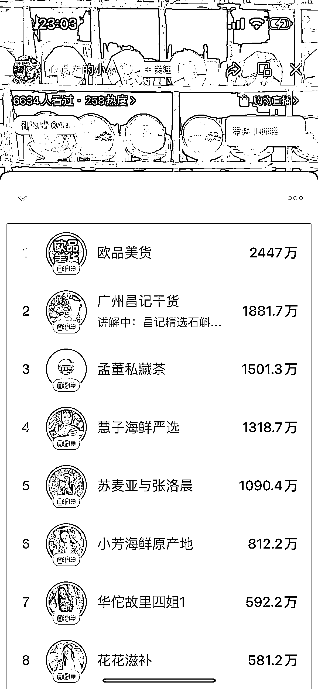
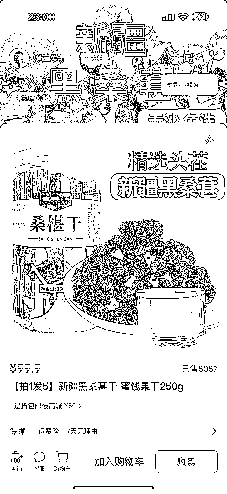
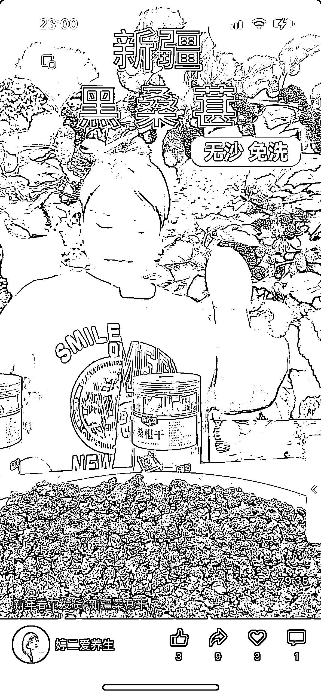
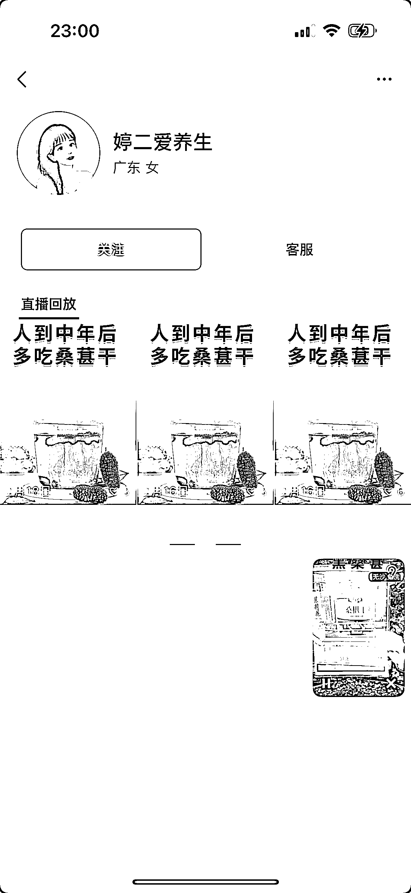
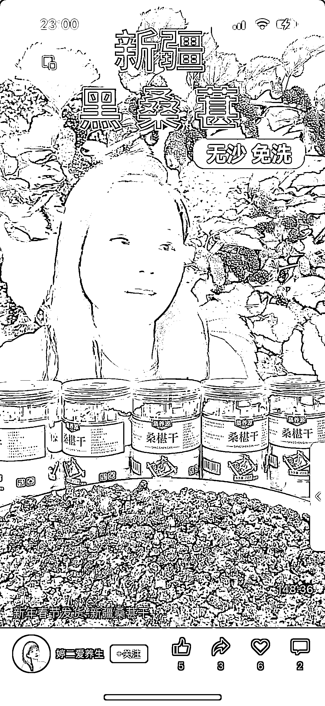
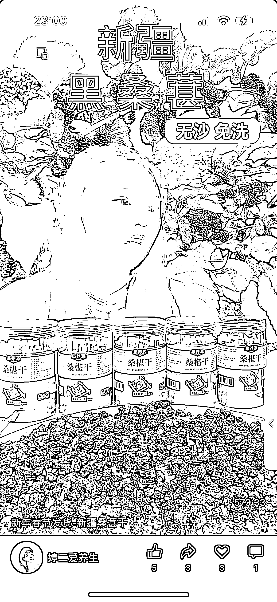
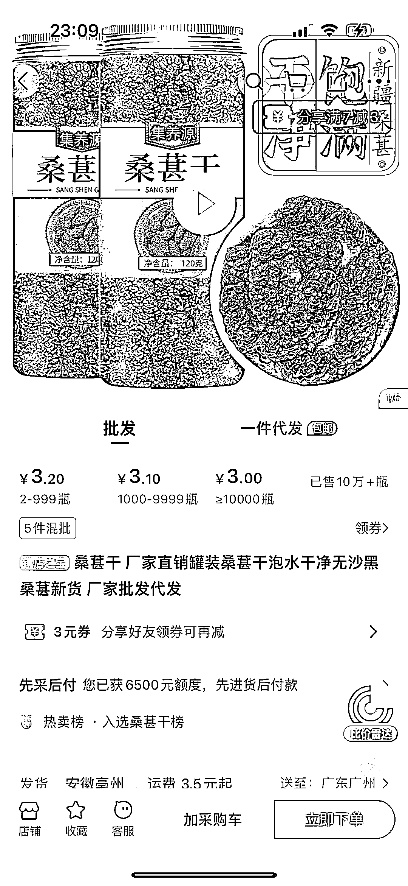

# 风向标：视频号食品类目，高毛利高销量，是一个不错的方向

> 原文：[`www.yuque.com/for_lazy/xkrm14/ydira5txcvagna1a`](https://www.yuque.com/for_lazy/xkrm14/ydira5txcvagna1a)

作者： 国威

日期：2024-02-26

点赞数：**36**

* * *

正文：

视频号 目前视频号食品类目，主打产品都是 农产品，茶叶，海味干货，海鲜类，还没出现过多包装和食品要求高的产品。
以下方账号来看，三个直播录屏作视频，可以了解到是直播间直接开播卖产品。 产品单价 100 元 6 件，3.2*6=19.2 100-19.2=80.8 80.8
/19.2=400% 可见毛利非常高，销量也很佳，100*5057=50w 的营业额 相信其他同类产品也是一个非常不错的方向

* * *

评论区：

国威 : 感谢亦仁[抱拳]

* * *

公众号懒人搜索，懒人专属群分享