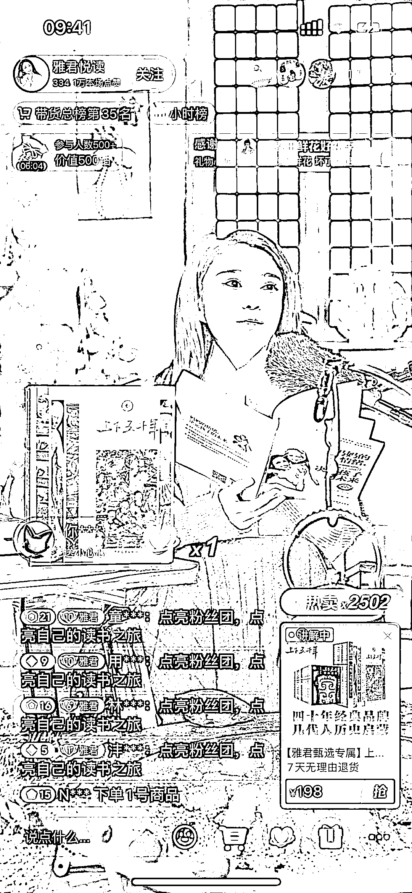
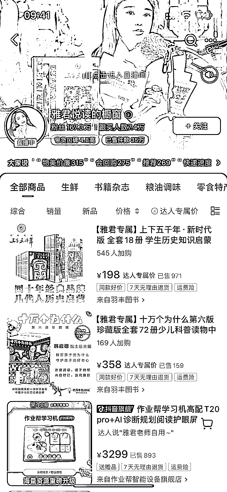
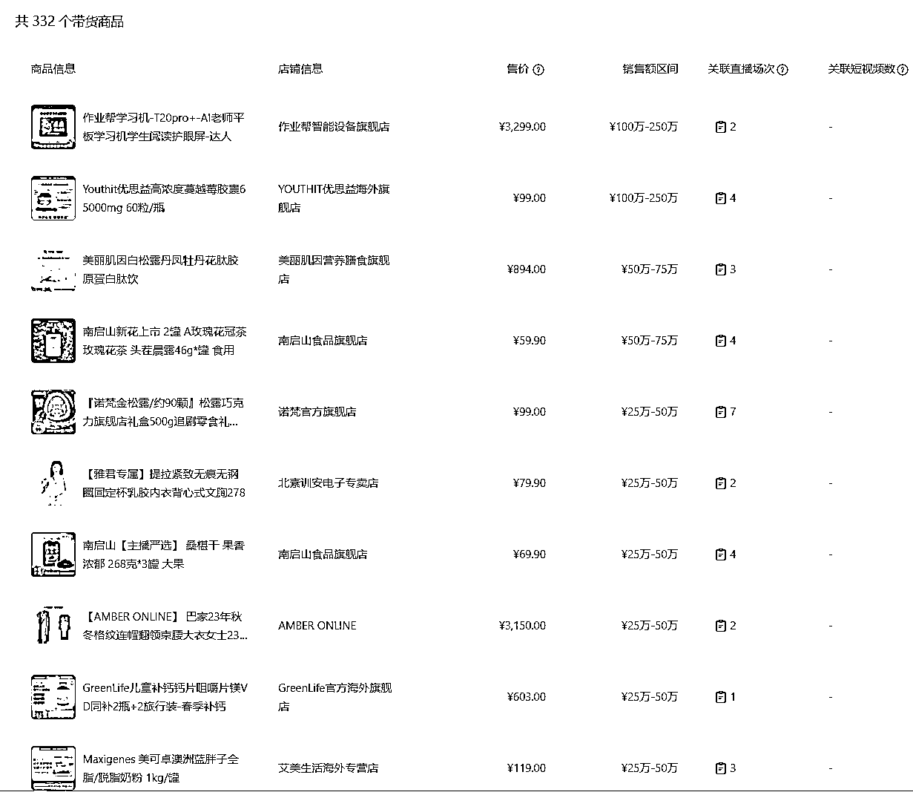
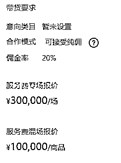

# 情感主播直播带货，销售额近 3 个月达 2500W，中产女性最爱购买的产品有哪些？

> 原文：[`www.yuque.com/for_lazy/xkrm14/zqr1xvf1xm6kraek`](https://www.yuque.com/for_lazy/xkrm14/zqr1xvf1xm6kraek)

作者： 北辰

日期：2024-03-01

点赞数：**69**

* * *

正文：

情感主播，直播带货。 主播设定：新闻播音员 主要人群：中产女性 直播数据：早晚两场，早晨在线 1W，晚上更高 橱窗销量：35W+
销售额：近 1 个月 250W-500W，近 3 个月 1000W-2500W。 主力销售产品：学习机、滋补品、食物、服饰

* * *

评论区：

BeCa 公主 : 目标啊

快乐柠檬 : 这种是纯自然流吗？我也刷到过，一个月利润有 100 个吧，不知道是不是团队操作

孤芳不自赏 : 这种有团队操作的！个人很难操作！

* * *

公众号懒人搜索，懒人专属群分享