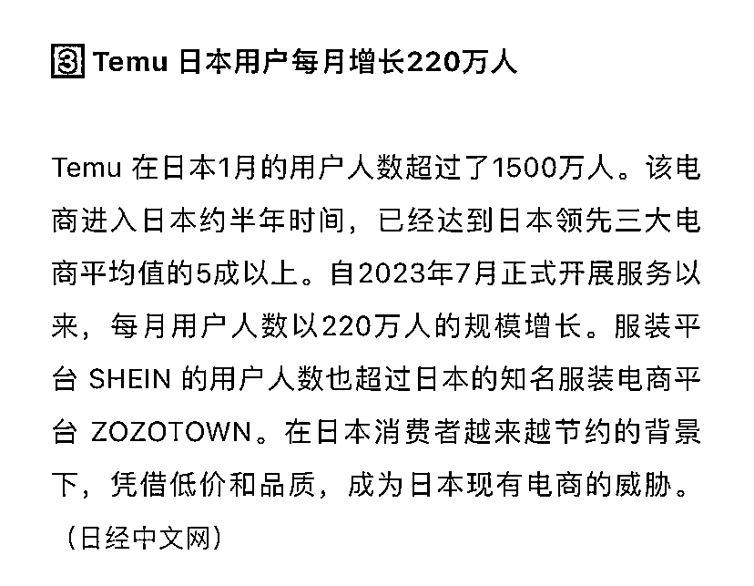

# Temu 在日本用户数量每月增长 220 万人

> 原文：[`www.yuque.com/for_lazy/xkrm14/eer59tbaupt3ma4t`](https://www.yuque.com/for_lazy/xkrm14/eer59tbaupt3ma4t)

作者： 罗破帽

日期：2024-02-26

点赞数：**30**

* * *

正文：

【Temu 日本用户每月增长 220 万人】 a.Temu
在日本 1 月的用户人数超过了 1500 万人。该电商进入日本约半年时间，已经达到日本领先三大电商平均值的 5 成以上。
b.自 2023 年 7 月正式开展服务以来，每月用户人数以 220 万人的规模增长。

* * *

评论区：

* * *

公众号懒人搜索，懒人专属群分享