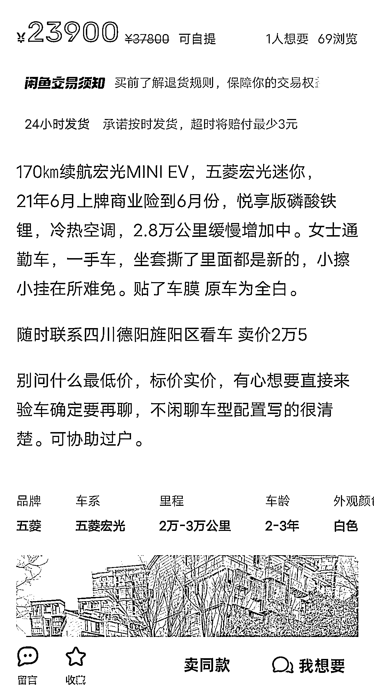

# 闲鱼成为卖车新宠，成交价高于二手市场

> 原文：[`www.yuque.com/for_lazy/xkrm14/zpzzm8t62atqvkku`](https://www.yuque.com/for_lazy/xkrm14/zpzzm8t62atqvkku)

作者： 极度专注

日期：2024-02-28

点赞数：**56**

* * *

正文：

今天和朋友聊天，说到他在闲鱼上卖车的事儿，我听到感觉还挺诧异的，闲鱼上竟然还能卖车，这个而且数据很好，咨询的人特别多，而且车辆的成交价比二手市场的价格要高很多，这个是我没想到，以五菱宏光 mini 为例子，朋友在闲鱼上卖了 2w 多，二手市场只给 1.3w..差距有点过多，感觉这里面可能还能有其他的机会，但是自己还没想到，先发出来。

* * *

评论区：

老李 : 我在闲鱼卖过四辆车，都是自己用的，问的人还特别多

老彭 : 大家可能觉得闲鱼上卖的都是真人，没有二手市场那么坑那么有可能是坏的

* * *

公众号懒人搜索，懒人专属群分享