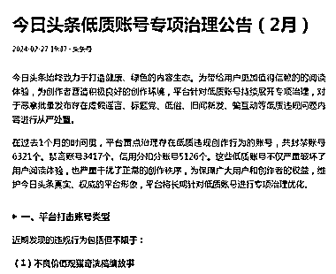
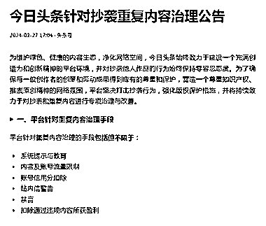

# 今日头条发布公告，打击抄袭重复内容和低质账号

> 原文：[`www.yuque.com/for_lazy/xkrm14/tf1d7nqxorzh0wr5`](https://www.yuque.com/for_lazy/xkrm14/tf1d7nqxorzh0wr5)

作者： Tiny

日期：2024-02-28

点赞数：**49**

* * *

正文：

今日头条发布公告，开始打击抄袭重复内容和低质账号 开始专项打击洗稿和一些标题党的情感类故事，夸大解读政策，诱骗点赞和低俗擦边类的内容，公告内有示例
今后自媒体的趋势还是要在内容上琢磨下功夫，搬运洗稿这条路将逐渐走不通 今日头条低质账号专项治理公告（2 月） 今日头条针对抄袭重复内容治理公告
[`www.toutiao.com/article/734024429178214864...`](https://www.toutiao.com/article/7340244291782148646/?log_from=aca8fceb839a4_1709081072965) [`www.toutiao.com/article/734020464886071349...`](https://www.toutiao.com/article/7340204648860713499/?log_from=1fbf3f669e998_1709081074269) 

* * *

评论区：

* * *

公众号懒人搜索，懒人专属群分享