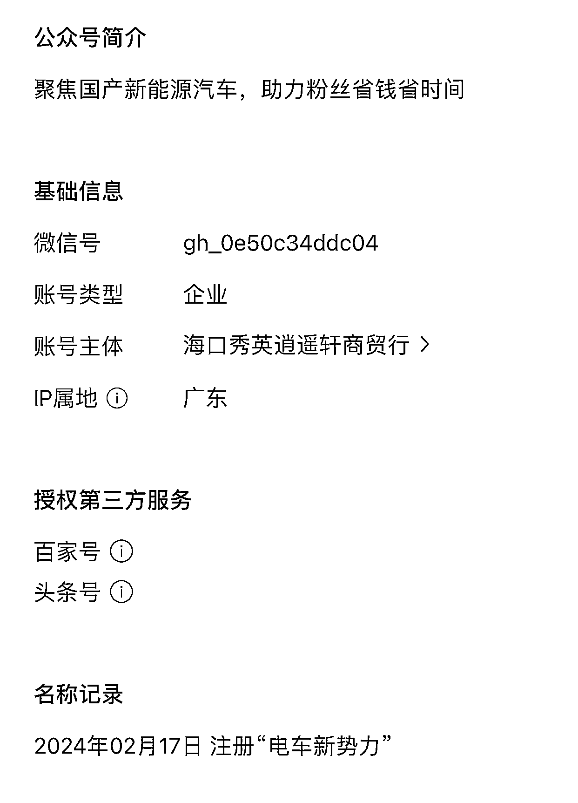
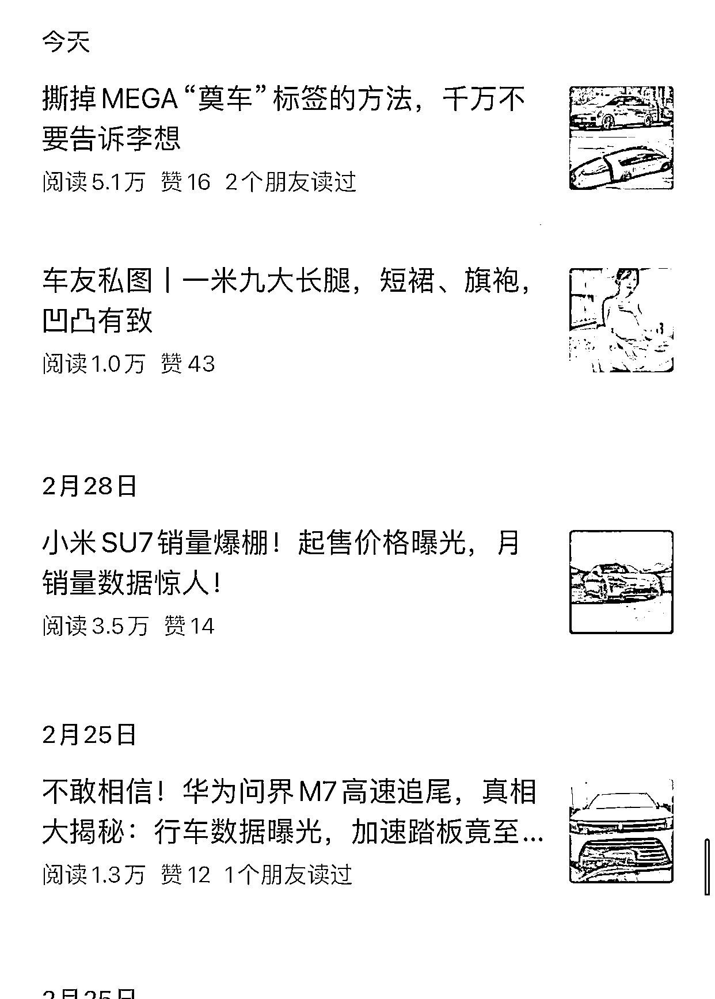

# 新注册的汽车公众号写出 4 篇爆款，揭示了创作者的启发

> 原文：[`www.yuque.com/for_lazy/xkrm14/ovigssrin746c55b`](https://www.yuque.com/for_lazy/xkrm14/ovigssrin746c55b)

作者： 林林 AIGC 写作

日期：2024-03-11

点赞数：**60**

* * *

正文：

今年 2 月 17 日才注册的汽车类公众号，主要关注国内电动车市场，目前已经写出了 4 篇爆款，除了其中一篇靠美女写真引流以外，其他三篇写的都是最近关注度很高的车型。
别看就出了 3 篇和账号主标签高度相关的爆款，但这背后其实也能给到我们很多启发。
一是国内电动车市场今年以来竞争白热化，好多家车企都在拼降价，同时头部车企疯狂下饺子出新车。对于创作汽车类内容的创作者来说是很大的利好，因为他们不需要花时间去找选题，更多时候选题会跟着近期汽车行业的热门新闻找上门。
二是写汽车类的公众号爆文也可以拿着热点话题使劲薅羊毛，比如像这个账号写理想 MEGA 的那一篇，我看了一下更多还是作者自己的戏谑和调侃，其实这类内容去抖音的汽车视频的评论区还有一些汽车论坛多刷刷也能找到灵感。
三是写汽车类公众号爆文也是不少新手不错的起点，因为国内很多汽车行业的相关资讯甚至是只有业内人士才能知道的消息，你都可以在一些汽车内容平台找到。这一点确实好过了写职场类公众号只能在脉脉这个 App 里面找素材。

* * *

评论区：

丑八怪 : 这个 ip 就很爆

林林 AIGC 写作 : 展开讲讲？

* * *

公众号懒人搜索，懒人专属群分享