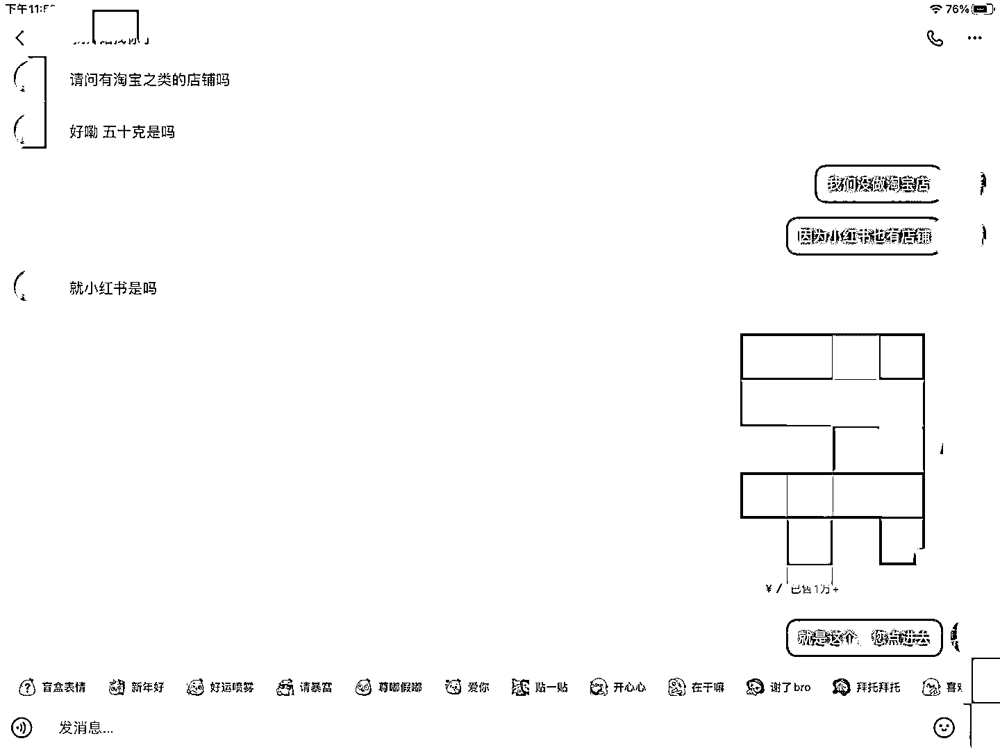
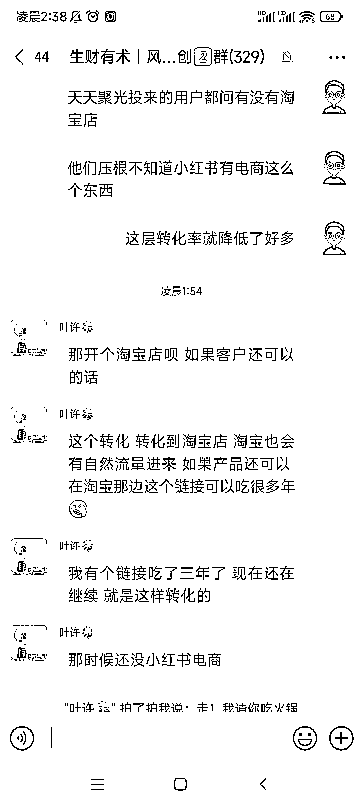
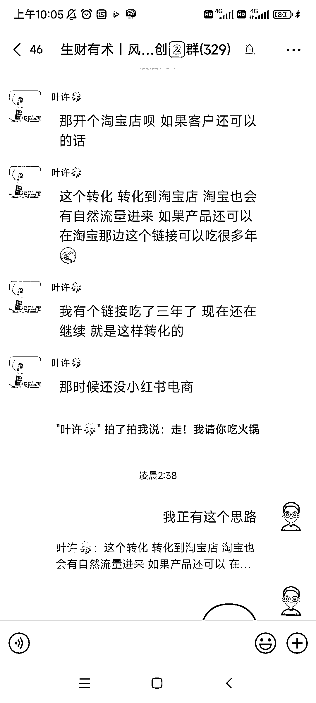

# 小红书电商潜力巨大，用户不知道还有淘宝店

> 原文：[`www.yuque.com/for_lazy/xkrm14/eikgqfopqgpd2am3`](https://www.yuque.com/for_lazy/xkrm14/eikgqfopqgpd2am3)

作者： 更绪

日期：2024-03-14

点赞数：**115**

* * *

正文：

最近做小红书电商发现了一个特别严重的问题，就是很多很多小红书的用户压根不知道小红书还有电商，每天会接待很多用户问我们有没有淘宝店。 可以提取两个信息：
①小红书电商还处于方兴未艾阶段，大有可为 ②和圈友交换了信息，可以直接导流淘宝，吃淘宝长尾流量！

* * *

评论区：

zy_ : 如果直接私聊时发淘宝店铺，不会判定导流吗？

更绪 : 聚光可以开白名单，我微信都导流大几千人了

* * *

公众号懒人搜索，懒人专属群分享