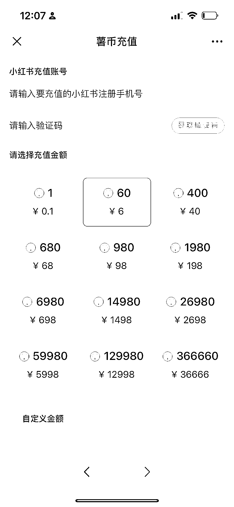
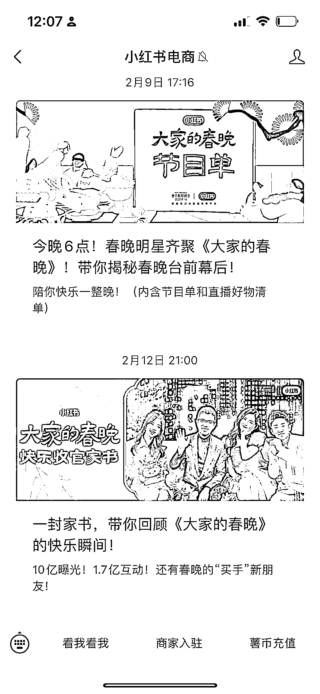
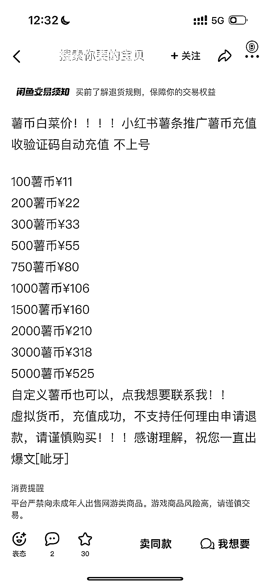

# 小红书薯币充值苹果手机手续费比安卓多 30%，如何避免被坑？

> 原文：[`www.yuque.com/for_lazy/xkrm14/oh1pd6igrcsr94gg`](https://www.yuque.com/for_lazy/xkrm14/oh1pd6igrcsr94gg)

作者： 陈舟

日期：2024-03-14

点赞数：**103**

* * *

正文：

跟大家分享一个信息差，小红书薯币充值苹果手机是比安卓多出 30%手续费的，很坑，苹果用户可以在小红书电商公众号上直接找薯币充值，就可以直接按原价去充了
这个信息差闲鱼上就有人在拿来赚钱。这个路子我们已经跑通了，不但可以充值赚钱还可以引流。 买薯条的都是认真做博主，到私域还可以转化小红书社群和课程二次变现

* * *

评论区：

Sing : 同理微信豆

加麻 : 而且苹果手机充值小红书薯条，小红书不给开发票，只能找苹果公司开收据

晴天 : 是因为苹果要收平台 30%抽成

林林 AIGC 写作 : 难怪安卓 1：10 的在 iPhone 是 1:7

宇星 : 抖币也是，所以我之前都是在网站上冲

蛤蟆先生 : 微信豆 iOS 充值官方有链接可以 1:10，我之前还发过风向标，虽然没中😂

肥仔梁 : 淘宝也有代充，我还冲过。

* * *

公众号懒人搜索，懒人专属群分享