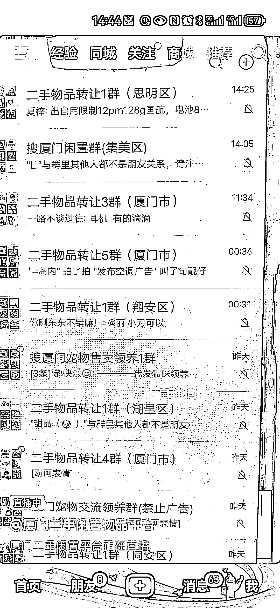
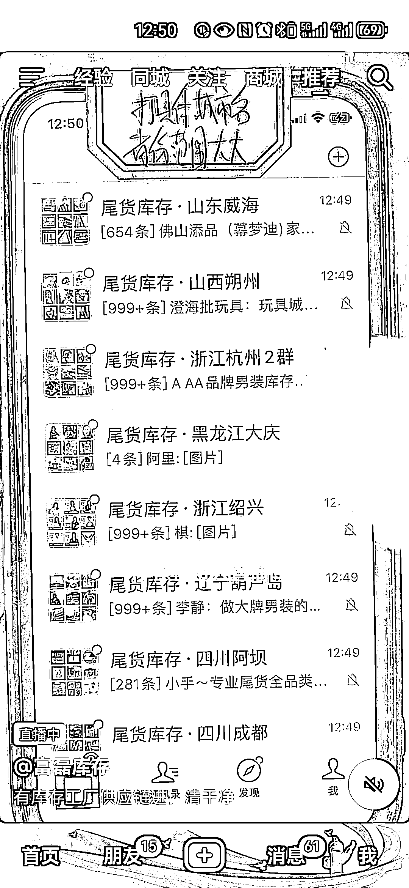
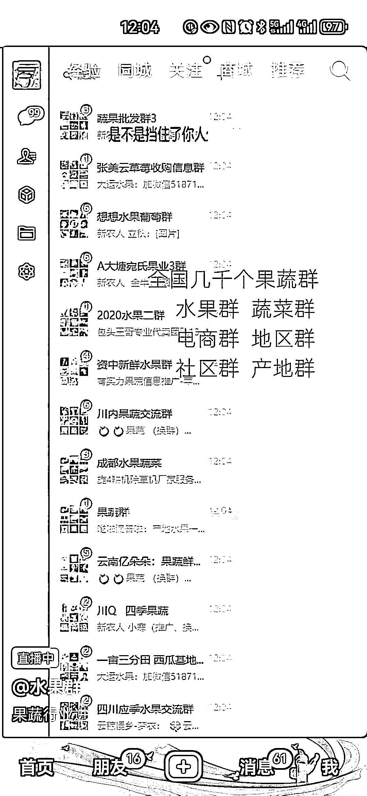
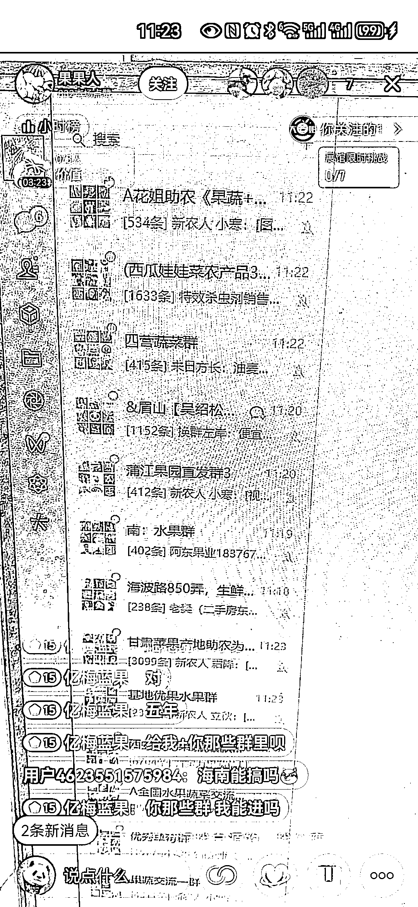
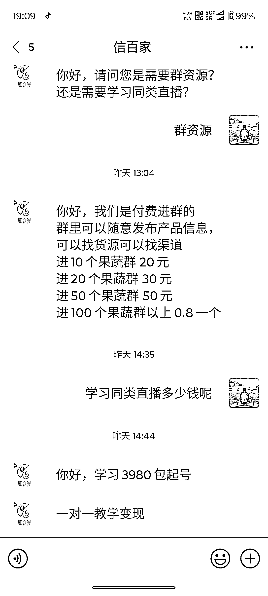

# 抖音直播卖地区划分的行业交流群

> 原文：[`www.yuque.com/for_lazy/xkrm14/rok423rd5dmb0anr`](https://www.yuque.com/for_lazy/xkrm14/rok423rd5dmb0anr)

作者： 希平

日期：2024-03-12

点赞数：**62**

* * *

正文：

在抖音直播卖以地区划分的行业交流群
最近在抖音刷到一批账号，卖地区划分的行业交流群，粉丝数基本一两千，场观也就 10-50 不等，但出现十几个直播账号都在做，这是异常值。
流量：基本是直播，直播时只需要对着手机电脑微信直接展示自己有多少个地区交流群，比如二手物品、租房、尾货库存、蔬菜、水果等（图 1 图 2 图 3 图 4），有用户问就回答一下。
转化：引导用户进入抖音群，然后在群公告给出微信号（图 5），之后用户添加微信，再去完成转化（图 6 图 7）。 服务/产品：主要有两种，
一种是自己的产品，行业群一个 1.5 元，学同类直播 2980 元（图 6） 另一种是朋友圈广告，帮各种商家打广告，比如食品、借款（图 7）
备注：社交在马斯洛需求属于第三层需求，是强需求，哪怕有微信微博抖音，但豆瓣一直都有活跃度，核心在于它有各种各样的交流圈子，如今这种交流需求，在“每个人都有一个微信”的情况下，圈子的载体可以从豆瓣即刻分流到微信。

* * *

评论区：

* * *

公众号懒人搜索，懒人专属群分享