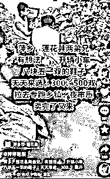
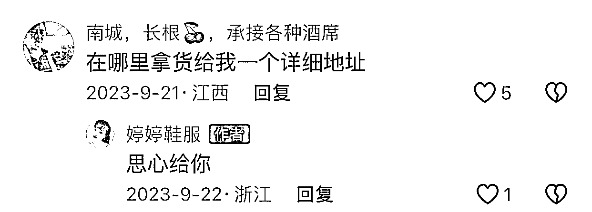

# 浙江某鞋厂抖音号引流方法揭秘，三点值得工厂老板学习

> 原文：[`www.yuque.com/for_lazy/xkrm14/hu6qxh9p0m3d4dku`](https://www.yuque.com/for_lazy/xkrm14/hu6qxh9p0m3d4dku)

作者： 林林 AIGC 写作

日期：2024-03-13

点赞数：**66**

* * *

正文：

疑似浙江某鞋厂的抖音号，目标客户以零售老板为主，引流方法相当简单粗暴，我拆解了一下，发现有这 3 点值得工厂老板们对标学习：
1.内容方面，直接上手机拍的视频，主打一个人气火爆，配上文案，说是某地老板开着什么大车豪车过来提货，一口气要了三五百双。没有人气，就制造人气。
2.运营方面，视频直接加全国各地定位，精准拦截当地零售业老板的流量。有老板评论区询盘的，直接私信转化。
3.主页留下联系方式作为钩子，懒得询盘的客户，也可以直接打开微信搜手机号加好友。
更可怕的是，他们的微信不知道加了全国各地多少地摊老板，要是担心光卖鞋子卖不动，他们也可以找汕头的玩具厂、白沟的箱包厂合作谈进货，用他们自己的微信朋友圈帮忙推广。

* * *

评论区：

倪大胖 : 请问这是多张图片弄成的动图吗

林林 AIGC 写作 :

* * *

公众号懒人搜索，懒人专属群分享